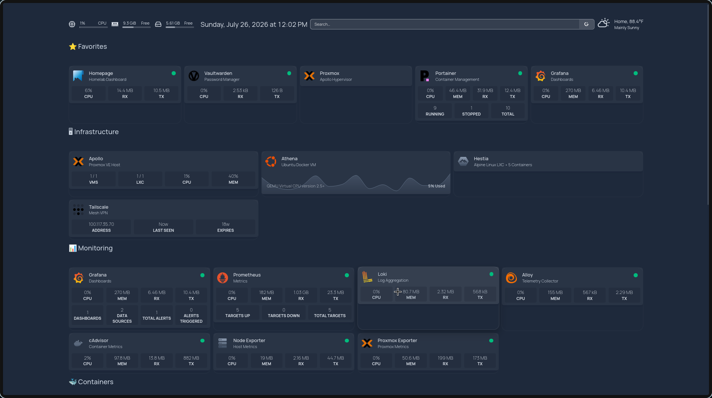
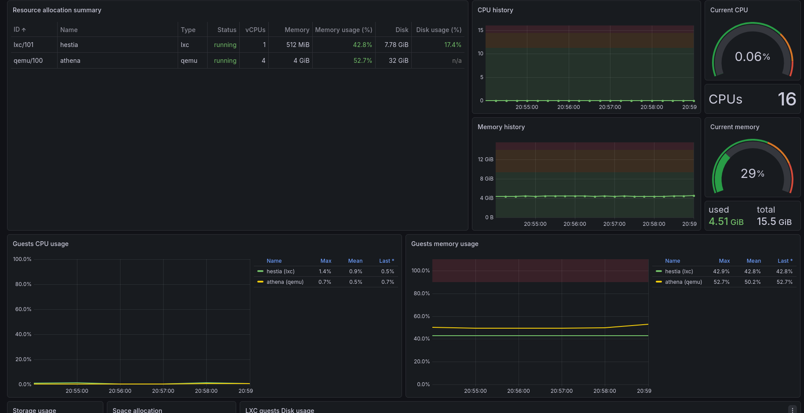
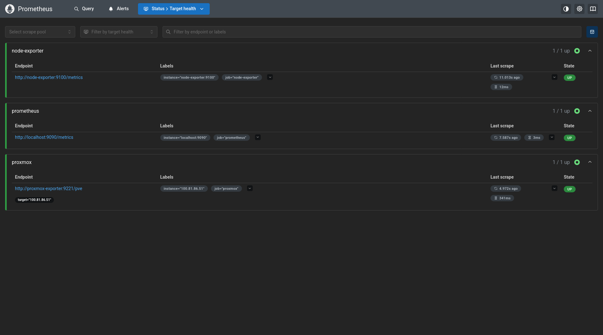
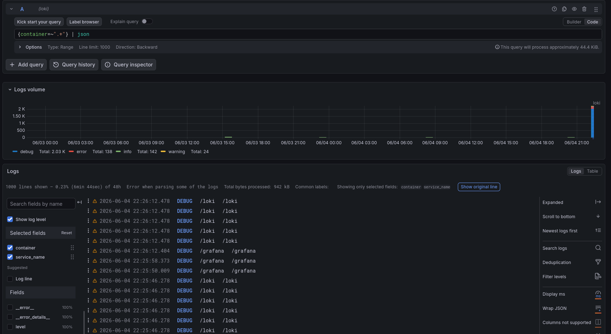
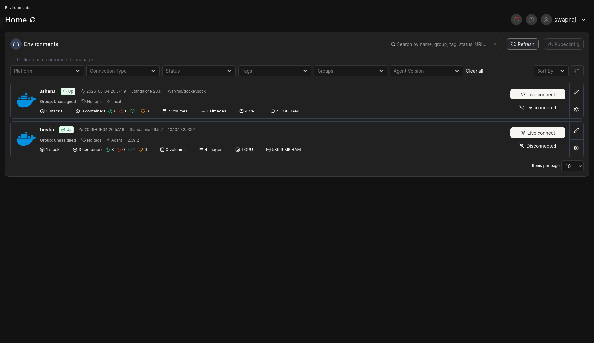
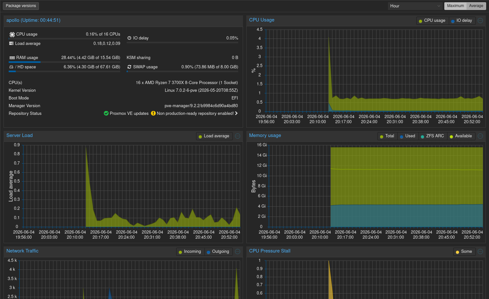

# HomeLab


A self-hosted homelab built on Proxmox VE for learning infrastructure engineering, observability, networking, automation, and disaster recovery practices.

The environment is fully manageable remotely through Tailscale and is designed to remain operational without physical access.

---

# Infrastructure Overview

```text
Artemis (Management Workstation)
        │
        ▼
    Tailscale
        │
        ▼
Apollo (Proxmox VE Host)
├── Hestia (LXC)
│   ├── Homepage Dashboard
│   └── Vaultwarden
│
└── Athena (Ubuntu VM)
    ├── Grafana
    ├── Prometheus
    ├── Loki
    ├── Promtail
    ├── Portainer
    └── LocalStack
```

---

# Key Achievements

* Built a multi-node Proxmox homelab
* Implemented remote management through Tailscale
* Centralized monitoring using Prometheus and Grafana
* Centralized log aggregation using Loki and Promtail
* Automated cloud resource provisioning using Terraform
* Validated infrastructure through reboot and disaster recovery testing
* Maintained complete infrastructure documentation
* Implemented Infrastructure as Code workflows using LocalStack and Terraform

---

# Technology Stack

## Infrastructure

* Proxmox VE
* Ubuntu Server
* Linux Containers (LXC)
* Docker

## Networking

* Tailscale
* Linux Bridges
* Proxmox Virtual Networking

## Monitoring & Logging

* Grafana
* Prometheus
* Loki
* Promtail
* Node Exporter
* Proxmox Exporter

## Automation

* Terraform
* LocalStack
* AWS CLI

---

# Repository Structure

```text
HomeLab/
├── architecture/
├── configs/
│   ├── apollo/
│   ├── athena/
│   └── hestia/
├── docker-compose/
├── docs/
├── screenshots/
├── scripts/
├── terraform/
├── README.md
├── LICENSE
├── HOMELAB_ROADMAP.md
└── tree.txt
```

---

# Documentation

| Document                  | Description                        |
| ------------------------- | ---------------------------------- |
| docs/architecture.md      | Infrastructure architecture        |
| docs/network.md           | Network topology and routing       |
| docs/inventory.md         | Infrastructure inventory           |
| docs/runbook.md           | Operational procedures             |
| docs/troubleshooting.md   | Issues encountered and resolutions |
| docs/disaster-recovery.md | Recovery procedures                |
| docs/validation-report.md | Validation and testing results     |
| docs/changelog.md         | Infrastructure changes over time   |

---

# Screenshots

## Homepage Dashboard



## Grafana Dashboard



## Prometheus Targets



## Loki Logs



## Portainer



## Proxmox



---

# Project Goals

* Learn infrastructure engineering fundamentals
* Learn observability and monitoring practices
* Learn Infrastructure as Code workflows
* Practice disaster recovery procedures
* Build operational experience with self-hosted services

---

# Roadmap

See:

HOMELAB_ROADMAP.md

for the complete project roadmap and milestones.

---

# License

MIT License
