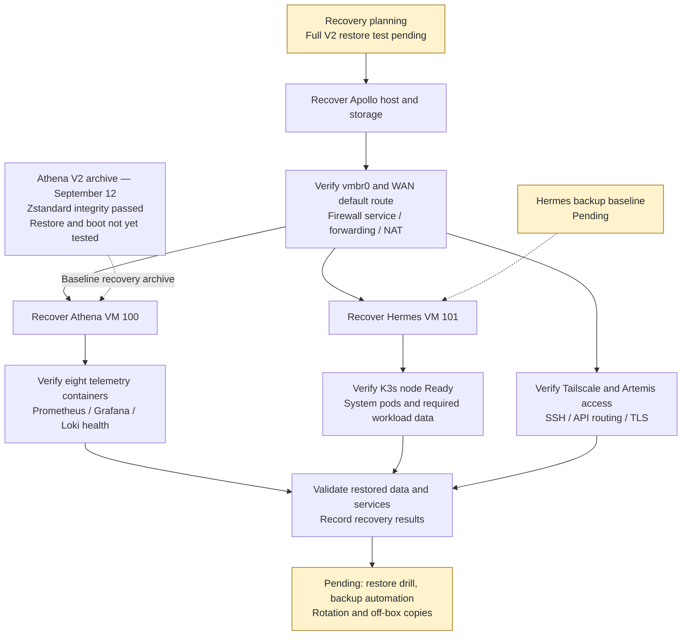

# V2 backup and disaster recovery

The [September 12 rebuild record](rebuild-history.md) reports preserved V1 data and a new Athena V2 baseline backup. Integrity checks passed; full restore testing remains pending.

## Retained recovery material

| Location | Recorded contents / verification |
|---|---|
| Apollo `/mnt/pve/Storage/dump/vzdump-lxc-101-2026_09_01-00_01_38.tar.zst` | Hestia September backup; `zstd -t` passed before CT destruction |
| Apollo `/mnt/pve/Storage/dump/vzdump-qemu-100-2026_09_12-18_35_13.vma.zst` | Athena V2 baseline; ~7.8 GB; `zstd -t` passed, reporting 28462859776 decompressed bytes |
| Apollo `/root/olympus-v1-backup/` and `/root/olympus-v1-backup.tar.gz` | Retained infrastructure configuration and V1 recovery material |
| Athena `/root/olympus-v1-backup/k3s/` | Old K3s configuration/service backup |
| Athena `/root/olympus-v1-backup/docker/override.conf` | Previous Docker systemd override |
| Athena `/root/olympus-v1-backup/portainer-volume.tar.gz` | Portainer data archive, inspected before volume removal |

The report also retains `vault.crt` and `vault.key`; preserve these recovery files. Same-named paths on Apollo and Athena are host-local; copying all Athena archives into Apollo's V1 tarball is not established. The named Athena backup's ordering relative to its package upgrade is not unambiguous in the supplied history.

## Recorded Athena backup procedure

Run Proxmox commands on **Apollo**, not inside Athena:

```bash
vzdump 100 \
  --storage Storage \
  --mode snapshot \
  --compress zstd \
  --notes-template "Olympus HomeLab V2 - Athena observability baseline"

zstd -t /mnt/pve/Storage/dump/vzdump-qemu-100-2026_09_12-18_35_13.vma.zst
```

The dated filename identifies the completed archive; a new backup creates a different filename. Keep the baseline archive. Zstandard testing verifies the compressed stream, not guest bootability or application recovery. SATA storage is on Apollo and is not an off-box copy.

## Pending recovery work

- Define automated schedules, rotation, protected off-box copies and backup scope for Apollo, Athena, Hermes and management credentials.
- Test isolated restores, boot, data integrity, telemetry and application behavior; record backup identifiers and measured recovery time.
- Establish a Hermes recovery point and test required Kubernetes persistent-data recovery.
- Plan Athena's Ubuntu migration separately with a tested rollback procedure.

Recover Apollo's foundation first when affected, then Athena observability and dependent workloads. Hestia's historical ID 101 is now Hermes VM 101; choose an unused identity and isolated network for any Hestia restore test. Historical recovery exercises do not establish current V2 restore coverage or RTO/RPO.

## Planned recovery workflow


