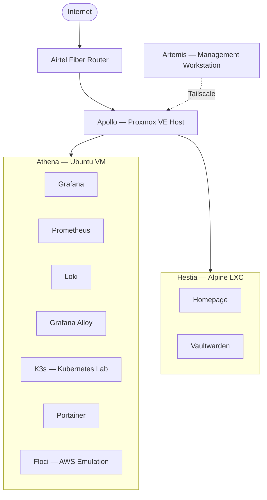
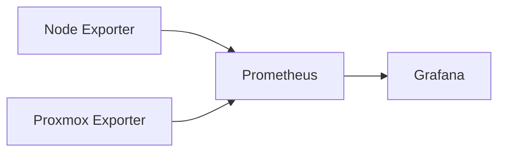
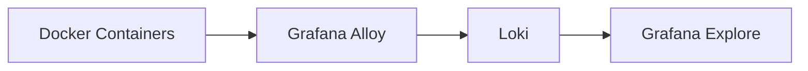
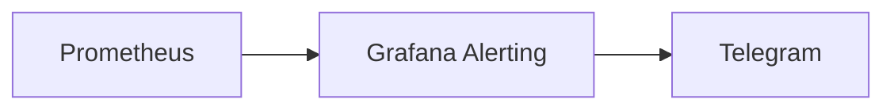
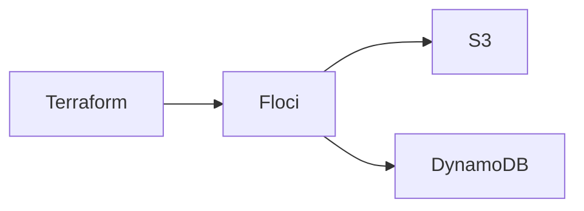
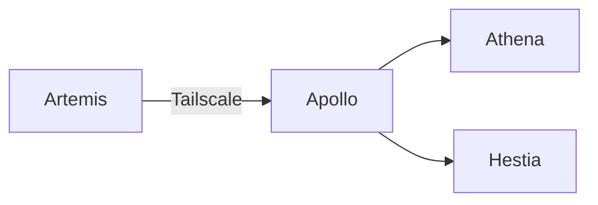

# Architecture

## Overview

Olympus HomeLab is a production-inspired infrastructure platform built to simulate real-world DevOps, Site Reliability Engineering (SRE), and cloud-native operations within a self-hosted environment.

It serves as a practical environment for learning and validating:

- Infrastructure Engineering
- DevOps & SRE
- Linux Administration
- Infrastructure as Code (Terraform)
- Kubernetes
- Observability
- Incident Response
- Disaster Recovery
- Systems Design

---

# Architecture Principles

The platform is designed around several core principles:

- **Private-by-default networking** with controlled ingress
- **Service isolation** between platform and application workloads
- **Remote-first administration** using Tailscale and SSH
- **Centralized observability**
- **Infrastructure as Code**
- **Operational resilience**
- **Incremental evolution through experimentation** — including reversing decisions (see `postmortems.md`) when a component turns out not to be worth its complexity

---

# High-Level Architecture

> Rendered natively on GitHub. Source also kept as a standalone file at `architecture-diagram.mmd` for editing in the [Mermaid Live Editor](https://mermaid.live).

---

# Infrastructure

## Apollo

**Role:** Hypervisor & Network Gateway

Apollo is the bare-metal Proxmox VE host that provides the compute foundation for the homelab.

### Responsibilities

- Virtual machine and LXC hosting
- Storage management
- Virtual networking
- Hardware abstraction
- Persistent NAT gateway
- Port forwarding for internal services

Apollo uses `iptables` to provide outbound internet access for internal workloads and selectively forwards traffic to trusted internal services. See `network.md` for the full NAT/DNAT rule set.

---

## Athena (Ubuntu VM)

**Role:** Operations, Observability & Kubernetes Platform

Athena acts as the operational core of the homelab.

### Hosted Services

| Service | Purpose |
|----------|---------|
| Grafana | Dashboards & Visualization |
| Prometheus | Metrics Collection |
| Loki | Centralized Logging |
| Grafana Alloy | Log Collection |
| Node Exporter | Host Metrics |
| Proxmox Exporter | Hypervisor Metrics |
| Portainer | Container Management |
| K3s | Kubernetes Lab |
| Floci | AWS Service Emulation |

### Responsibilities

- Centralized observability
- Kubernetes experimentation
- Container management
- Infrastructure monitoring

The K3s cluster operates as a single-node Kubernetes environment with cgroup v2 enabled for stable operation.

> **Note:** Athena previously also hosted a custom FastAPI "Dashboard API" that aggregated LastFM, weather, Pokémon, and similar personal-data feeds for a custom Homepage widget. That entire concept — the API, its fetch scripts, and the associated cron jobs — was removed. See "Decommissioned: Olympus Dashboard API" below and `postmortems.md` for the full history.

---

## Hestia (Alpine LXC)

**Role:** Application Frontend

Hestia hosts lightweight user-facing services.

### Hosted Services

| Service | Purpose |
|----------|---------|
| Homepage | Infrastructure Dashboard |
| Vaultwarden | Password Manager |

The container is intentionally lightweight, providing:

- Fast startup
- Low resource usage
- Strong workload isolation

Homepage runs in its **stock, unmodified configuration** — a simple service-link dashboard with no custom JavaScript/CSS and no external API dependency. This is a deliberate simplification after the custom "Olympus" widget (and later, the Dashboard API backing it) proved too fragile and high-maintenance relative to the value it added. See `postmortems.md` for that decision.

---

## Artemis

**Role:** Management Workstation

Artemis is the external administration workstation used to manage the entire environment.

### Responsibilities

- SSH administration
- Git operations
- Terraform development
- Kubernetes management
- Documentation
- Remote infrastructure access

Keeping management tooling outside the infrastructure ensures administration remains possible during partial service failures.

---

# Decommissioned: Olympus Dashboard API

For a period, Homepage was extended into a custom "Olympus Command Center" backed by a FastAPI aggregation service on Athena (LastFM, weather, Pokémon, investments, MyAnimeList, dynamic wallpapers). It has been **fully removed**:

- No Dashboard API container, fetch scripts, or cron jobs remain on Athena.
- No custom `custom.js` / `custom.css` remain on Hestia.
- Homepage runs its default configuration only.

This is intentionally documented here rather than deleted from history, because the reasoning behind removing it — tight coupling to Homepage internals, cross-device timing bugs, and maintenance cost outweighing the payoff — is itself a useful engineering lesson. Full build-and-removal narrative: `postmortems.md`.

---

# Observability Architecture

## Metrics Pipeline

### Features

- Host monitoring
- VM monitoring
- Capacity planning
- Resource utilization
- Infrastructure dashboards

---

## Logging Pipeline

Provides centralized log aggregation, historical search, and troubleshooting.

> **Known gap:** Docker container discovery in Alloy is currently incomplete — only 2 of 9 running containers are being ingested. Tracked in `postmortems.md` (2026-07-05) and `troubleshooting.md`.

---

## Alerting Pipeline

Alerts cover:

- Host availability
- Service availability
- CPU utilization
- Memory utilization
- Disk capacity
- Infrastructure health

---

# Infrastructure as Code

Infrastructure provisioning and cloud experimentation are managed using Terraform.

### Benefits

- Reproducible deployments
- Local AWS workflow validation
- Zero cloud cost experimentation
- Safe infrastructure testing

---

# Security Architecture

The homelab follows a defense-in-depth approach.

## Principles

- Private-by-default networking
- No unnecessary public exposure
- Tailscale-only remote administration
- Service isolation
- Least-privilege communication

---

## Remote Access

Administrative access is performed entirely through Tailscale and SSH.

Apollo provides internal routing using persistent NAT and selectively forwards only required services to the internal network.

---

# Operational Status

| Component | Status |
|----------|--------|
| Apollo | Healthy |
| Athena | Healthy |
| Hestia | Healthy |
| Artemis | Healthy |
| Grafana | Operational |
| Prometheus | Operational |
| Loki | Operational (partial log discovery — see `troubleshooting.md`) |
| Grafana Alloy | Operational (partial log discovery — see `troubleshooting.md`) |
| K3s | Operational |
| Homepage | Operational (stock configuration) |
| Vaultwarden | Operational |
| Dashboard API | Decommissioned — removed |

---

# Current State

**Phase:** Stable Operational Environment

The Olympus HomeLab currently provides:

- Secure private infrastructure
- Centralized observability (metrics + logs, logs partially complete)
- Kubernetes experimentation
- Infrastructure as Code workflows
- Self-hosted applications (Homepage, Vaultwarden)
- Remote-first administration
- Production-inspired operational practices

The platform continues to evolve incrementally while maintaining a stable, production-inspired architecture. The most recent major change was simplifying the frontend back down to a stock Homepage instance after retiring the custom dashboard integration.
