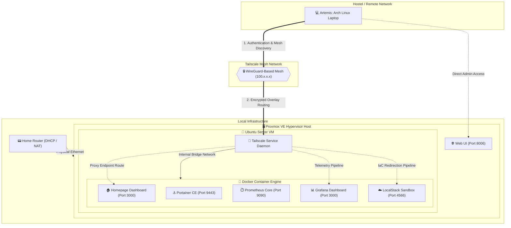

# 🗺️ HomeLab System Architecture

This document provides a comprehensive technical blueprint of the headless homelab infrastructure. It charts network pathways, virtualization boundaries, and security perimeters to ensure reliable remote administration from a hostel or external network.

---

## 📐 Conceptual Topography Diagram

The diagram below outlines the secure connection path from the remote administration laptop (Artemis), across the encrypted Tailscale mesh network, directly into the virtualized application layers running on the Proxmox VE hypervisor host.



---

## 🔌 System Port Matrix

| Service Component | Host Network Binding | Protocol / Security Profile | Core Purpose |
| --- | --- | --- | --- |
| **Proxmox Web UI** | `https://<pve-ip>:8006` | HTTPS (TLS Secured) | Hypervisor cluster management & VM provisioning |
| **Homepage** | `http://100.117.35.70:3000` | HTTP (Tailnet Bound) | Unified navigation entry-point dashboard |
| **Portainer CE** | `https://100.117.35.70:9443` | HTTPS (Self-Signed) | Visual container cluster orchestration |
| **Prometheus** | `http://100.117.35.70:9090` | HTTP (Internal) | Time-series engine tracking hardware nodes |
| **Grafana** | `http://100.117.35.70:3000` | HTTP (Tailnet Bound) | Visualization suite for system performance graphs |
| **LocalStack API** | `http://100.117.35.70:4566` | HTTP (Dev Sandbox) | Emulated AWS cloud services interface (S3/DynamoDB) |

```

*Save and exit the file by typing **`:wq`** and pressing **`Enter`**.*

---


