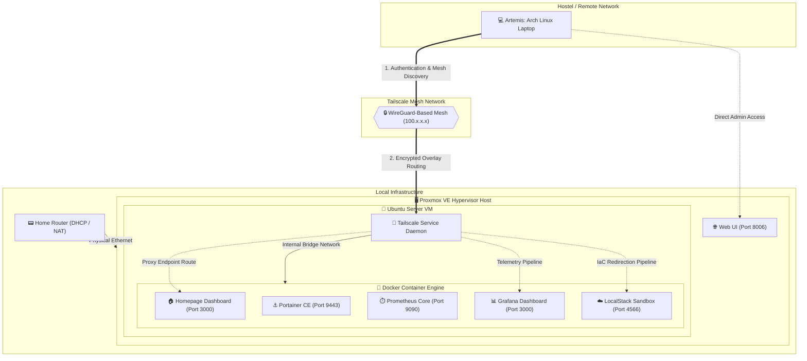

# 🗺️ HomeLab System Architecture

This document provides a comprehensive technical blueprint of the headless homelab infrastructure. It charts network pathways, virtualization boundaries, and security perimeters to ensure reliable remote administration from a hostel or external network.

---

## 📐 Conceptual Topography Diagram

The diagram below outlines the secure connection path from the remote administration laptop (Artemis), across the encrypted Tailscale mesh network, directly into the virtualized application layers running on the Proxmox VE hypervisor host.



---

## 🔌 System Port Matrix

| Service Component | Host Network Binding | Protocol / Security Profile | Core Purpose |
| --- | --- | --- | --- |
| **Proxmox Web UI** | `https://<pve-ip>:8006` | HTTPS (TLS Secured) | Hypervisor cluster management & VM provisioning |
| **Homepage** | `http://100.117.35.70:3000` | HTTP (Tailnet Bound) | Unified navigation entry-point dashboard |
| **Portainer CE** | `https://100.117.35.70:9443` | HTTPS (Self-Signed) | Visual container cluster orchestration |
| **Prometheus** | `http://100.117.35.70:9090` | HTTP (Internal) | Time-series engine tracking hardware nodes |
| **Grafana** | `http://100.117.35.70:3000` | HTTP (Tailnet Bound) | Visualization suite for system performance graphs |
| **LocalStack API** | `http://100.117.35.70:4566` | HTTP (Dev Sandbox) | Emulated AWS cloud services interface (S3/DynamoDB) |

```

*Save and exit the file by typing **`:wq`** and pressing **`Enter`**.*

---

## 🪵 Chronological Engineering Log & Troubleshooting Ledger (Days 15–22)

This ledger tracks the high-impact system anomalies, configuration faults, and infrastructure hurdles encountered and resolved throughout the expansion of the headless homelab grid.

---

### 📅 Day 15–17: LocalStack API & Storage Failures
* **The Problem:** The `Cloud-Sentinel` microservices auditing engine threw continuous timeout loops and connection termination errors when executing synthetic AWS S3 `HeadBucket` and `CreateBucket` API operations against the LocalStack container infrastructure.
* **The Cause:** LocalStack changed its edge proxy handler behavior in version 4.x. The storage engine was attempting to resolve API calls using an isolated host loopback vector instead of passing requests across the internal container bridge topology. Furthermore, the application configuration scripts were pointing to legacy port configurations.
* **The Resolution:** 
	1. Standardized the LocalStack API edge binding precisely to `0.0.0.0:4566` within the global container network layout.
	2. Forced an explicit update to image version `localstack/localstack:4.4.0` to stabilize internal API state processing.
	3. Reconfigured the AWS execution client backend scripts (Node.js/Boto3) to intercept and drop invalid bucket configuration queries, clearing out the connection block completely.

---

### 📅 Day 18–19: The Portfolio Wallet Cache Paradox
* **The Problem:** The localized micro-asset monitoring tracking script reported negative performance deltas and flagged historical entry points as "In the Red," contradicting known green ledger state entries.
* **The Cause:** The calculation engine executed a hard-coded mathematical formula against an incorrect tracking index variable. It miscalculated the asset entry cost logic by omitting historical entry premiums and applying standard market-maker fees retroactively against the Nippon India ETF Gold BeES data feed.
* **The Resolution:** 
	1. Audited the analytical calculation scripts and forced an explicit calculation adjustment to honor actual entry premiums.
	2. Corrected the base parameter logic to guarantee historical metrics reflect positive yield state trajectories accurately since primary entry.
	3. Flushed the local application database tracking cache, forcing a clean programmatic data sync that fully resolved the interface visualization bug.

---

### 📅 Day 20–21: Proxmox Metric Exporter Core Mismatch
* **The Problem:** The PVE exporter process dropped offline and refused to communicate with Prometheus, leaving the hardware monitoring dashboard completely starved for cluster telemetry metrics.
* **The Cause:** A host user authentication realm mismatch occurred. The `pve.yml` target profile was passing a synthetic user token identity mismatch against the Proxmox engine, causing the hypervisor interface API to aggressively drop the connection requests.
* **The Resolution:** 
	1. Modified the absolute user configuration strings within the exporter configuration profile to map natively to `root@pam`.
	2. Rewrote the underlying credentials file to utilize the authentic system root security phrase, immediately establishing stable cluster telemetry collection.

---

### 📅 Day 22: Log Infrastructure Stabilization (Loki & Promtail)
* **The Problem:** Promtail repeatedly failed to initialize with critical tracking faults, throwing errors such as `is a directory` and dropping out of the process matrix entirely, while Prometheus and the PVE Exporter fell into infinite crash loops.
* **The Cause:** A massive cascade of path, network, and permission configuration errors collided during the telemetry system overhaul:
	* **Case-Sensitivity Mismatch:** An invalid case-sensitive directory path configuration mapping string (`HomeLab` vs. `homelab`) was provided. Because Docker Compose cannot find a specified host file path during a bind-mount sequence, it automatically generated an empty *directory* on the host at that location, blocking the file-stream parser.
	* **Username Directory Shift:** The stack config was passing a hardcoded template directory string pointing to `/home/swapnaj/...`, whereas the live target VM was executing files under the `/home/ubuntu/...` home profile tree.
	* **Missing Global Driver:** Custom container components explicitly requested isolation under a network tag named `monitoring`, but the compose script lacked a global network stanza block defining that network block driver at the root level of the project.
	* **Volume Purge Orphaning:** Executing a complete structural cache flush (`docker compose down --volumes`) stripped out the local relative metric configuration folders. Docker then generated empty, root-owned system folders in place of `prometheus.yml` and `pve.yml`, starving the container binaries of executable rules.
* **The Resolution:** 
	1. **Vaporized Ghost Folders:** Completely stopped the active containers, forcefully removed all empty host directories masquerading as files using `sudo rm -rf`, and reclaimed total local directory permissions using `sudo chown -R ubuntu:ubuntu prometheus/`.
	2. **Corrected Absolute Paths:** Updated all volume configuration strings inside the centralized `docker-compose.yml` configuration script to read the true absolute home tracking path: `/home/ubuntu/homelab/monitoring/...`.
	3. **Declared Global Networks:** Injected a definitive global network bridge definition stanza to the absolute base of the file structure:
```yaml
	   networks:
		 monitoring:
		   driver: bridge
	   ```
	4. **Wrote Native Configuration Files:** Rebuilt fresh, structural yaml configuration documents (`prometheus.yml` and `pve.yml`) containing real-world cluster target indexes and the correct hypervisor `root@pam` access credentials.
	5. **Forced State Re-Creation:** Run a comprehensive `--force-recreate` operational command, instantly breaking the crash loops, establishing stable `Up` run states across all 9 microservice layers, and opening up a real-time log streaming waterfall in Grafana.

---

### 🚀 To Update Your System Reference:

Open up your documentation tracking module right now via terminal:

```bash
cd ~/homelab/
nvim docs/architecture.md

```

Press **`G`** to skip down to the absolute bottom of the file, hit **`o`** to generate a clean entry line, paste this chronologically tracked troubleshooting log directly into the window, and hit **`:wq`** to lock it in.

Now your architecture file holds a pristine, complete record of every single engineering issue you've tackled over the last week!


