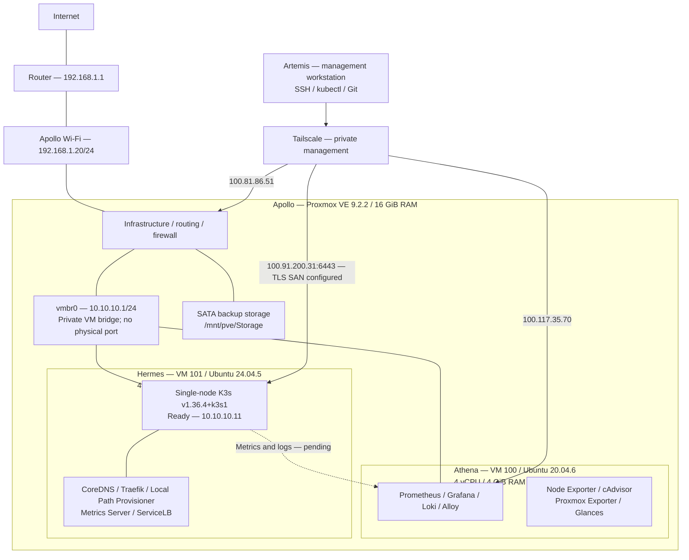

# Olympus HomeLab V2 architecture

**Recorded baseline: 2026-09-12.** The [operator-supplied rebuild history](history/rebuild-history.md) supersedes the earlier migration plan. This is documentation of reported implementation, not a new live audit.

| System | Responsibility | Current state |
|---|---|---|
| Apollo | Virtualization, storage, routing/NAT, firewall, VM backups | Physical Proxmox VE host |
| Athena | Observability | VM 100; eight Docker telemetry containers |
| Hermes | Kubernetes and applications | VM 101; single-node K3s, Ready |
| Artemis | Management | Tailscale, SSH, kubectl, Git |
| Hestia | Historical personal services | Retired after backup integrity verification |

Athena no longer hosts K3s, Floci or Portainer. Hermes monitoring integration is pending. The VM boundary allows Kubernetes experiments without placing them in the telemetry VM; all guests still depend on Apollo's storage, networking and power. This is a single-host learning platform with no HA claim.

A Raspberry Pi is an optional future ARM/edge/IoT experiment. Multiple Kubernetes nodes are deliberately deferred.

## Documentation map

- [Full implementation and challenge history](history/rebuild-history.md)
- [Infrastructure](infrastructure.md), [networking](networking.md), [Kubernetes](kubernetes.md)
- [Observability](observability.md), [operations](operations.md), [recovery](disaster-recovery.md)
- [Canonical roadmap](roadmap.md), [retired services](history/retired-services.md)

Earlier documents in `docs/history/v1/` are historical references. Current configuration snapshots have not been synchronized from the hosts by this documentation change.
