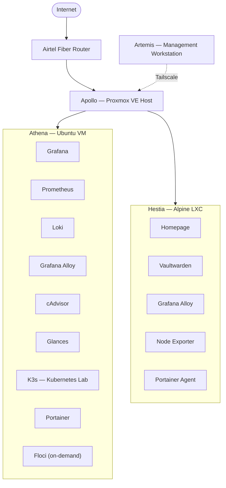
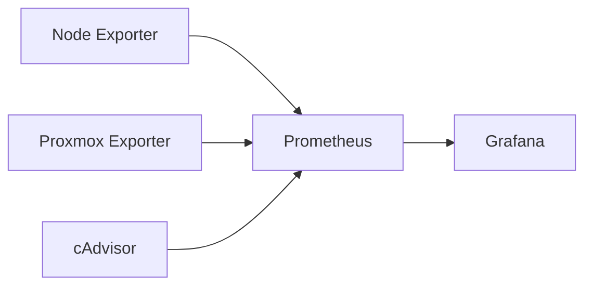
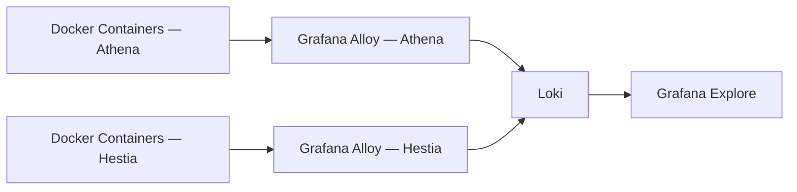
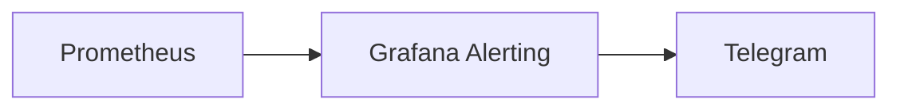
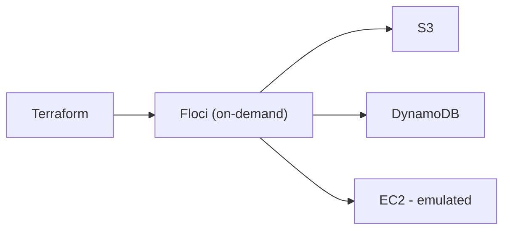
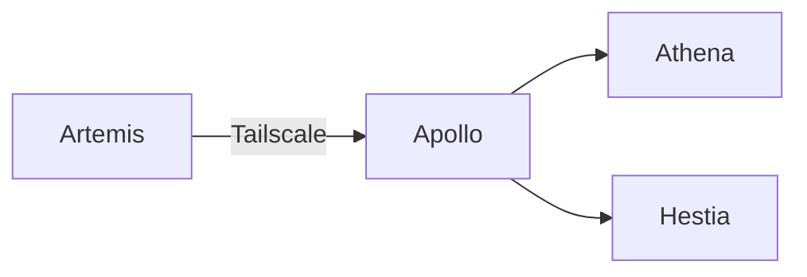

# Architecture

## Overview

Olympus HomeLab is a production-inspired infrastructure platform built to simulate real-world DevOps, Site Reliability Engineering (SRE), and cloud-native operations within a self-hosted environment.

It serves as a practical environment for learning and validating:

- Infrastructure Engineering
- DevOps & SRE
- Linux Administration
- Infrastructure as Code (Terraform)
- Kubernetes
- Observability
- Incident Response
- Disaster Recovery
- Systems Design

---

# Architecture Principles

The platform is designed around several core principles:

- **Private-by-default networking** with controlled ingress
- **Service isolation** between platform and application workloads
- **Remote-first administration** using Tailscale and SSH
- **Centralized observability**
- **Infrastructure as Code**
- **Operational resilience**
- **Incremental evolution through experimentation** — including reversing decisions (see `postmortems.md`) when a component turns out not to be worth its complexity

---

# High-Level Architecture

> Rendered natively on GitHub. Source also kept as a standalone file at `architecture-diagram.mmd` for editing in the [Mermaid Live Editor](https://mermaid.live).

---

# Infrastructure

## Apollo

**Role:** Hypervisor & Network Gateway

Apollo is the bare-metal Proxmox VE host that provides the compute foundation for the homelab.

### Hardware

AMD Ryzen 7 3700X (8 cores/16 threads), 16GB DDR4-3200, a 238.5GB NVMe drive hosting the Proxmox LVM-thin pool plus a 232.9GB SATA drive as a secondary storage pool, and an idle NVIDIA GTX 1660 Super (not currently passed through to any guest). Full spec in `inventory.md`.

### Responsibilities

- Virtual machine and LXC hosting
- Storage management
- Virtual networking
- Hardware abstraction
- Persistent NAT gateway
- Port forwarding for internal services

Apollo uses `iptables` (legacy backend) to provide outbound internet access for internal workloads and selectively forwards traffic to trusted internal services. Firewall/NAT logic is managed by a dedicated, idempotent script (`/usr/local/sbin/apollo-firewall.sh`) with dynamic WAN interface detection, run via a `systemd` unit at boot — rather than hardcoded rules embedded in network config. A migration to `nftables` was evaluated and explicitly declined, since Apollo's `iptables-legacy` backend runs independently from `nftables`, and Tailscale/Docker/K3s already manage their own `iptables` chains. The service initially recurred twice (2026-07-26/27, 2026-07-31) due to a boot-time race condition with Wi-Fi association timing; it's now hardened with a 30-second in-script retry loop plus `systemd` auto-recovery (`Restart=on-failure`, `RestartSec=10s`). See `network.md` and `postmortems.md` (2026-07-18, 2026-07-26→31) for the full architecture and decision record.

---

## Athena (Ubuntu VM)

**Role:** Operations, Observability & Kubernetes Platform

Athena acts as the operational core of the homelab.

### Hosted Services

| Service | Purpose |
|----------|---------|
| Grafana | Dashboards & Visualization |
| Prometheus | Metrics Collection |
| Loki | Centralized Logging |
| Grafana Alloy | Log Collection |
| Node Exporter | Host Metrics |
| Proxmox Exporter | Hypervisor Metrics |
| cAdvisor | Per-container resource metrics |
| Glances | Lightweight system monitor |
| Portainer | Container Management |
| K3s | Kubernetes Lab |
| Floci | AWS Service Emulation — started on-demand, not always running |

### Responsibilities

- Centralized observability (for both Athena and Hestia — see below)
- Kubernetes experimentation
- Container management
- Infrastructure automation

The K3s cluster operates as a single-node Kubernetes environment with cgroup v2 enabled for stable operation. It currently runs CoreDNS, the local-path provisioner, the metrics server, and the Portainer Agent — no Ingress controller (Traefik) is deployed.

> **Note:** Athena previously also hosted a custom FastAPI "Dashboard API" that aggregated LastFM, weather, Pokémon, and similar personal-data feeds for a custom Homepage widget. That has been decommissioned from active deployment; the code itself is intentionally retained in the repository as a portfolio reference. See "Decommissioned: Olympus Dashboard API" below and `postmortems.md` for the full history.

---

## Hestia (Alpine LXC)

**Role:** Application Frontend

Hestia hosts lightweight user-facing services — and, per a live audit, its own local monitoring/agent footprint too.

### Hosted Services

| Service | Purpose |
|----------|---------|
| Homepage | Infrastructure Dashboard |
| Vaultwarden | Password Manager |
| Grafana Alloy | Per-host log collection, forwarding to Loki on Athena |
| Node Exporter | Per-host system metrics |
| Portainer Agent | Lets Athena's central Portainer manage Hestia remotely |

The container is intentionally lightweight (1 core, 512MB RAM, 8GB disk), providing:

- Fast startup
- Low resource usage
- Strong workload isolation

Homepage runs with its **stock service-discovery features intact**, plus a lightweight custom visual theme (`custom.css` — rounded cards, hover animation, header subtitle, scrollbar styling; no data-fetching logic). Its `custom.js` file is confirmed empty. This is a deliberate simplification after the earlier "Olympus" data widget (and the Dashboard API backing it) proved too fragile and high-maintenance relative to the value it added. See `postmortems.md` for that decision. Homepage's native Kubernetes/Docker/Proxmox widgets remain enabled (via a scoped read-only `ClusterRole` — see `inventory.md`), since those are stock features, not custom code.

---

## Artemis

**Role:** Management Workstation

Artemis is the external administration workstation used to manage the entire environment.

### Responsibilities

- SSH administration
- Git operations
- Terraform development
- Kubernetes management
- Documentation
- Remote infrastructure access

Keeping management tooling outside the infrastructure ensures administration remains possible during partial service failures.

---

# Decommissioned: Olympus Dashboard API

For a period, Homepage was extended into a custom "Olympus Command Center" backed by a FastAPI aggregation service on Athena (LastFM, weather, Pokémon, investments, MyAnimeList, dynamic wallpapers). It has been **decommissioned from active deployment** as of 2026-07-10:

- No Dashboard API container, fetch scripts, or cron jobs are running.
- No custom data-widget `custom.js` remains active (confirmed empty).
- Homepage runs its stock service-discovery config, plus an unrelated, lightweight visual theme.

**The Dashboard API's source code is intentionally kept in the repository** (`docker-compose/dashboard-api/`) rather than deleted — it's a real, working FastAPI service worth having visible as a portfolio artifact, even though it isn't part of the active deployment. This is documented here rather than hidden, because the reasoning behind retiring it from production — tight coupling to Homepage internals, cross-device timing bugs, and maintenance cost outweighing the payoff — is itself a useful engineering lesson. Full build-and-decommission narrative: `postmortems.md`.

---

# Observability Architecture

## Metrics Pipeline

### Features

- Host monitoring (both Athena and Hestia)
- Per-container resource monitoring
- VM monitoring
- Capacity planning
- Resource utilization
- Infrastructure dashboards

---

## Logging Pipeline

Provides centralized log aggregation, historical search, and troubleshooting across both hosts. Alloy runs per-host and forwards to the single Loki instance on Athena.

**Status:** Fully operational — a Docker log discovery gap that previously limited ingestion to 2 of 9 containers (opened 2026-07-05) has been resolved; a live audit on 2026-07-18 confirmed all 12 running containers across both hosts are being ingested. See `postmortems.md`.

---

## Alerting Pipeline

Alerts cover:

- Host availability
- Service availability
- CPU utilization
- Memory utilization
- Disk capacity
- Infrastructure health

---

# Infrastructure as Code

Infrastructure provisioning and cloud experimentation are managed using Terraform.

### Benefits

- Reproducible deployments
- Local AWS workflow validation
- Zero cloud cost experimentation
- Safe infrastructure testing

Floci is started only when doing AWS-emulation work, not left running continuously. LocalStack (Floci's predecessor) remains on disk for reference but is not part of the active stack.

---

# Security Architecture

The homelab follows a defense-in-depth approach.

## Principles

- Private-by-default networking
- No unnecessary public exposure
- Tailscale-only remote administration
- Service isolation
- Least-privilege communication (e.g., Homepage's read-only K8s `ClusterRole`)

---

## Remote Access

Administrative access is performed entirely through Tailscale and SSH. The Tailscale mesh currently includes Artemis, Apollo, Athena, and a personal Android device — Hestia remains intentionally excluded.

Apollo provides internal routing using persistent NAT and selectively forwards only required services to the internal network.

---

# Operational Status

| Component | Status |
|----------|--------|
| Apollo | Healthy |
| Athena | Healthy |
| Hestia | Healthy |
| Artemis | Healthy |
| Grafana | Operational |
| Prometheus | Operational |
| Loki | Operational — full ingestion |
| Grafana Alloy | Operational (both hosts) |
| K3s | Operational (no Ingress controller deployed) |
| Homepage | Operational (stock + visual theme) |
| Vaultwarden | Operational |
| Floci | Operational (on-demand) |
| Dashboard API | Decommissioned from deployment — code retained in repo |

---

# Current State

**Phase:** Stable Operational Environment

The Olympus HomeLab currently provides:

- Secure private infrastructure
- Centralized observability across both hosts (metrics + fully-working logs)
- Kubernetes experimentation
- Infrastructure as Code workflows
- Self-hosted applications (Homepage, Vaultwarden)
- Remote-first administration
- Production-inspired operational practices

The platform continues to evolve incrementally while maintaining a stable, production-inspired architecture. Recent changes include simplifying the frontend back down to stock Homepage plus a lightweight theme after retiring the custom dashboard integration, and reworking (then hardening) Apollo's NAT/firewall layer into a dedicated, idempotent script with dynamic WAN detection and boot-time retry logic (after root-causing a real outage to a hardcoded interface name, evaluating — then declining — a migration to `nftables`, and then fixing two further recurrences caused by a boot-time race condition).

---

# Planned: Hermes VM (Not Yet Built)

A new VM, **Hermes**, is planned to take over K3s and Floci from Athena, so that deliberately experimenting on and breaking K3s doesn't risk the always-on observability stack that's needed to diagnose it. This is **not yet built** — everything in this document reflects the current, live architecture (Athena still hosts K3s and Floci). Full plan: `HOMELAB_ROADMAP.md` ("Planned: Hermes VM — K3s / Floci Split") and `project-timeline.md` (Phase 13).
