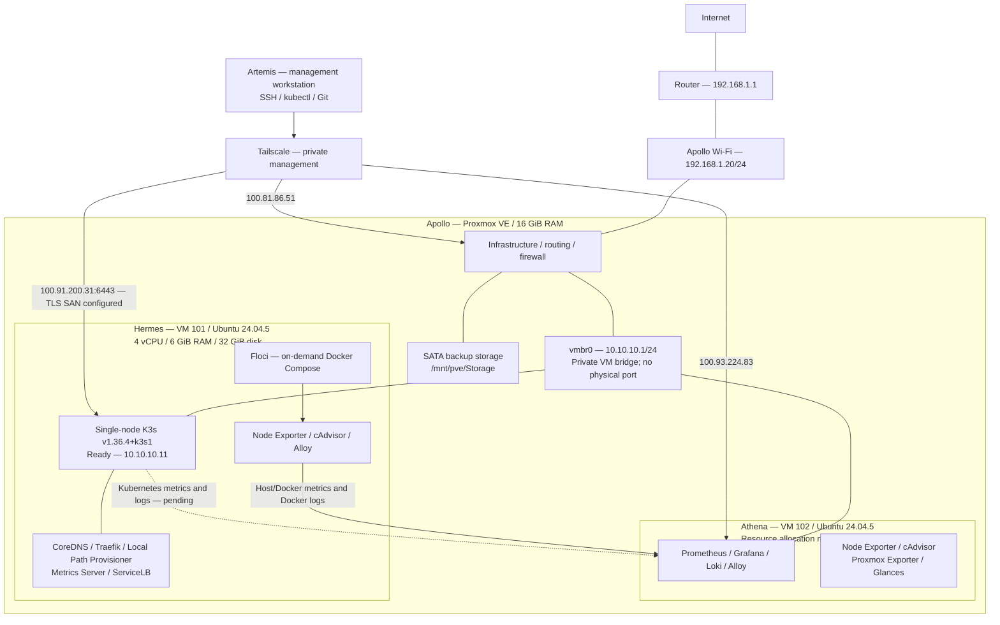

# Olympus HomeLab V2 architecture

**Updated 2026-10-09 from the [operator-supplied post-migration report](history/athena-migration-report.md).** Athena VM 102 supersedes VM 100. This records reported implementation, not a new live audit.

| System | Responsibility | Current state |
|---|---|---|
| Apollo | Virtualization, storage, routing/NAT, firewall, VM backups | Physical Proxmox VE host |
| Athena | Observability | VM 102; eight Docker telemetry containers |
| Hermes | Kubernetes and applications | VM 101; single-node K3s, Ready |
| Artemis | Management | Tailscale, SSH, kubectl, Git |
| Hestia | Historical personal services | Retired after backup integrity verification |

```mermaid
flowchart TB
    Artemis["Artemis — management workstation<br/>SSH / kubectl / Git"]
    Tailnet["Tailscale — private management"]
    Artemis --> Tailnet
    Internet["Internet"] --- Router["Router — 192.168.1.1"]
    Router --- WAN["Apollo Wi-Fi — 192.168.1.20/24"]

    subgraph Apollo["Apollo — Proxmox VE / 16 GiB RAM"]
        Host["Infrastructure / routing / firewall"]
        Bridge["vmbr0 — 10.10.10.1/24<br/>Private VM bridge; no physical port"]
        Backups["SATA backup storage<br/>/mnt/pve/Storage"]
        subgraph Athena["Athena — VM 102 / Ubuntu 24.04.5<br/>Resource allocation not supplied"]
            Telemetry["Prometheus / Grafana / Loki / Alloy"]
            Exporters["Node Exporter / cAdvisor<br/>Proxmox Exporter / Glances"]
        end
        subgraph Hermes["Hermes — VM 101 / Ubuntu 24.04.5<br/>4 vCPU / 6 GiB RAM / 32 GiB disk"]
            K3s["Single-node K3s v1.36.4+k3s1<br/>Ready — 10.10.10.11"]
            System["CoreDNS / Traefik / Local Path Provisioner<br/>Metrics Server / ServiceLB"]
            K3s --- System
            Floci["Floci — on-demand Docker Compose"]
            HermesTelemetry["Node Exporter / cAdvisor / Alloy"]
            Floci --> HermesTelemetry
        end
        Host --- Bridge
        Host --- Backups
        Bridge --- Telemetry
        Bridge --- K3s
    end
    WAN --- Host
    Tailnet -->|100.81.86.51| Host
    Tailnet -->|100.93.224.83| Telemetry
    Tailnet -->|100.91.200.31:6443 — TLS SAN configured| K3s
    HermesTelemetry -->|Host/Docker metrics and Docker logs| Telemetry
    K3s -.->|Kubernetes metrics and logs — pending| Telemetry
    classDef pending fill:#fff3cd,stroke:#9a6700,color:#24292f;
```

Athena no longer hosts K3s, Floci or Portainer. **Hermes host/Docker monitoring integration is reported complete** (Node Exporter and a dedicated cAdvisor `0.60.5` on Hermes feed Athena's Prometheus; Grafana Alloy on Hermes feeds Athena's Loki — see [rebuild history §63](history/rebuild-history.md#63-hermes--athena-observability-integration-complete)). Floci now runs on Hermes via Docker Compose, on-demand. The VM boundary allows Kubernetes experiments without placing them in the telemetry VM; all guests still depend on Apollo's storage, networking and power. The September 14 resize applied to old Athena VM 100 and Hermes. Replacement Athena VM 102 resources are not specified in the latest account. This is a single-host learning platform with no HA claim.

Multiple Kubernetes nodes are deferred until suitable hardware is available; Oracle is a possible future worker. [Olympus](olympus.md) is a proposed lightweight infrastructure dashboard on Hermes K3s, using server-side Proxmox/Prometheus/Loki/Kubernetes APIs while Grafana remains the detailed observability interface.

## Documentation map

- [Full implementation and challenge history](history/rebuild-history.md)
- [Infrastructure](infrastructure.md), [networking](networking.md), [Kubernetes](kubernetes.md)
- [Observability](observability.md), [operations](operations.md), [recovery](disaster-recovery.md)
- [Canonical roadmap](roadmap.md), [retired services](history/retired-services.md)

Earlier documents in `docs/history/v1/` are historical references. Current configuration snapshots have not been synchronized from the hosts by this documentation change.
