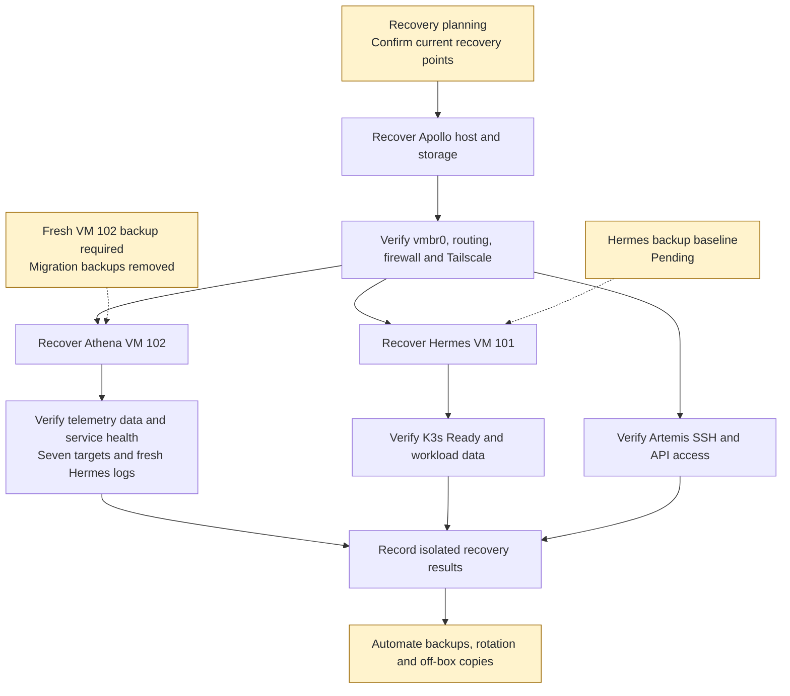

# V2 backup and disaster recovery

The [post-migration report](history/athena-migration-report.md), incorporated 2026-10-09, supersedes the September VM 100 recovery baseline. Exact migration and cleanup dates were not supplied.

## Migration outcome and current recovery gap

Athena moved from VM 100 / Ubuntu 20.04 to VM 102 / Ubuntu 24.04. Prometheus, Grafana and Loki data and telemetry configuration were restored and verified. Health checks covered Prometheus, Loki, Grafana, cAdvisor, seven scrape targets and fresh Hermes → Loki logs.

After successful verification, VM 100 and its disk were deleted. Migration backups temporarily held on `/mnt/pve/Storage` were also removed. This is evidence of a successful migration restore, not a standing rollback copy or a complete disaster-recovery drill. A retained VM 102 backup is not established by the supplied report.

## Historical material requiring inventory

The [September rebuild record](history/rebuild-history.md) documented the VM 100 baseline archive `vzdump-qemu-100-2026_09_12-18_35_13.vma.zst`, Hestia's `vzdump-lxc-101-2026_09_01-00_01_38.tar.zst`, Apollo's `/root/olympus-v1-backup/` and tarball, and old Athena-local K3s/Docker/Portainer backups. The migration report does not identify every deleted archive by filename or establish that VM 100-local recovery material was copied to VM 102. Re-inventory these paths before relying on them; do not treat the old Athena archive as a confirmed available backup.

Apollo's SATA storage is on the same physical host and is not an off-box copy. Hestia's former ID 101 now belongs to Hermes VM 101.

## Required recovery work

- Create and verify a fresh Athena VM 102 recovery point; record its exact archive identifier and location.
- Establish Hermes VM 101 and Kubernetes persistent-data backup scope.
- Include Apollo configuration, infrastructure credentials, required certificates/keys and management recovery material.
- Define schedules, retention, protected off-box copies and recovery objectives.
- Test isolated restores, guest boot, data integrity, telemetry and application behavior; record results and recovery time.

Proxmox backup operations belong on Apollo. Select current guest IDs (Athena 102, Hermes 101), verified storage and an appropriate maintenance window. Zstandard integrity alone does not prove application recovery. No backup or deletion commands were run against the hosts by this documentation update.

## Planned recovery workflow

