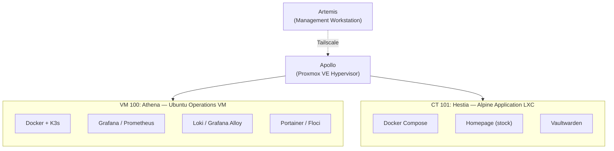
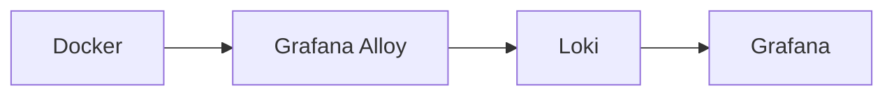
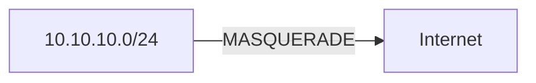

# Infrastructure Inventory

## Overview

This document serves as the authoritative inventory of the Olympus HomeLab environment. It documents all physical hardware, virtual infrastructure, containerized services, Kubernetes workloads, networking components, and operational assets.

The inventory acts as the single source of truth for infrastructure management, troubleshooting, capacity planning, and disaster recovery.

---

# Environment Summary

| Category | Count | Status |
|----------|------:|--------|
| Physical Nodes | 2 | Healthy |
| Hypervisors | 1 | Operational |
| Virtual Machines | 1 | Healthy |
| LXC Containers | 1 | Healthy |
| Docker Services | 9 | Operational |
| Kubernetes Cluster | 1 | Healthy |
| Kubernetes Pods | 5+ | Running |
| Monitoring Components | 6 | Healthy (logging partially complete — see `troubleshooting.md`) |
| Self-Hosted Applications | 2 | Operational |

---

# Infrastructure Topology



---

# Physical Infrastructure

## Apollo

**Role:** Primary Infrastructure Host

| Property | Value |
|----------|-------|
| Platform | Proxmox VE 8.x |
| Type | Type-1 Hypervisor |
| Status | Healthy |

### Responsibilities

- Virtual Machine Hosting
- LXC Hosting
- Storage Management
- Virtual Networking
- Persistent NAT Gateway
- DNAT Port Forwarding
- Bridge Management (`vmbr0`)

### Hosted Workloads

| ID | Workload | Type |
|----|----------|------|
| 100 | Athena | Ubuntu VM |
| 101 | Hestia | Alpine LXC |

---

## Artemis

**Role:** Management Workstation

| Property | Value |
|----------|-------|
| Platform | Arch Linux |
| Type | Physical Laptop |
| Status | Healthy |

### Responsibilities

- SSH Administration
- kubectl Management
- Terraform Operations
- Git Repository Management
- Documentation
- Remote Infrastructure Management
- Browser Access to Internal Services

---

# Virtual Infrastructure

## Athena (VM 100)

**Role:** Operations, Observability & Kubernetes Platform

| Property | Value |
|----------|-------|
| OS | Ubuntu Server |
| Runtime | Docker Compose + K3s |
| LAN IP | `10.10.10.10` |
| Status | Healthy |

### Key Configuration

- cgroup v2 Enabled
- Docker Compose Runtime
- Single-node K3s Cluster
- Infrastructure Automation Host

### Hosted Services

| Service | Port | Purpose |
|---------|------|---------|
| Grafana | 3001 | Dashboards & Alerting |
| Prometheus | 9090 | Metrics Collection |
| Loki | 3100 | Log Aggregation |
| Grafana Alloy | Host | Log Collection |
| Node Exporter | Internal | System Metrics |
| Proxmox Exporter | Internal | Hypervisor Metrics |
| Portainer | 9443 | Container Management |
| Floci | 4566 | AWS Emulation |
| K3s Control Plane | 6443 | Kubernetes API |

## Hestia (CT 101)

**Role:** Frontend Application Platform

| Property | Value |
|----------|-------|
| OS | Alpine Linux |
| Runtime | Docker Compose |
| LAN IP | `10.10.10.2` |
| Tailscale | Disabled |
| Status | Healthy |

> Hestia is intentionally isolated from the Tailscale mesh and is accessible only through Apollo's port forwarding rules.

### Hosted Services

| Service | Port | Purpose |
|---------|------|---------|
| Homepage | 3000 | Infrastructure Dashboard (stock configuration, no custom widgets) |
| Vaultwarden | 8080 | Password Management |

---

# Kubernetes Inventory

## K3s Cluster

| Property | Value |
|----------|-------|
| Distribution | K3s |
| Topology | Single Node |
| Host | Athena |
| Status | Healthy |

### Features

- Kubernetes Control Plane
- Worker Node
- CoreDNS
- Metrics Server
- Traefik
- Portainer Agent
- Learning Namespace (`artemis-lab`)

### Management

Remote administration is performed from Artemis using:

```bash
kubectl
```

The Kubernetes API is accessed through Athena's LAN IP (`10.10.10.10`) to match the certificate SANs — the Tailscale IP is not covered by the K3s-issued certificate (see `postmortems.md`, 2026-06-21).

---

# Monitoring & Observability

## Grafana

**Purpose**

- Dashboards
- Metrics Visualization
- Log Exploration
- Alerting

**Status:** Healthy

---

## Prometheus

**Purpose**

- Metrics Collection
- Time-Series Database
- Alert Evaluation

### Monitored Targets

- Node Exporter
- Proxmox Exporter
- Docker Services
- K3s Components

**Status:** Healthy

---

## Loki

**Purpose**

- Centralized Log Storage
- Log Search
- Historical Retention

**Status:** Healthy (ingestion incomplete — see below)

---

## Grafana Alloy

**Purpose**

- Docker Log Discovery
- Log Collection
- Log Forwarding

**Pipeline**



**Status:** Running, but only ingesting logs from 2 of 9 running containers (`grafana`, `loki`). `discovery.docker`/`loki.source.docker` targeting is the suspected cause and is not yet resolved — see `troubleshooting.md` and `postmortems.md` (2026-07-05).

---

## Node Exporter

**Metrics**

- CPU
- Memory
- Disk
- Filesystem
- Network

**Status:** Healthy

---

## Proxmox Exporter

**Metrics**

- Hypervisor
- Virtual Machines
- Containers
- Storage
- CPU
- Memory

**Status:** Healthy

---

# Application Inventory

## Homepage

| Property | Value |
|----------|-------|
| Host | Hestia |
| Port | 3000 |
| Access | DNAT via Apollo |

### Features

- Stock service-link dashboard
- No custom JavaScript/CSS
- No external API dependency

Homepage previously ran a heavily customized "Olympus" widget backed by a dedicated Dashboard API on Athena. Both were removed; see "Decommissioned Components" below.

---

## Vaultwarden

| Property | Value |
|----------|-------|
| Host | Hestia |
| Port | 8080 |
| Protocol | HTTPS Only |

### Notes

- Persistent Storage
- Password Management
- Accessible only through Apollo port forwarding
- Serves HTTPS internally on port 80 (`ROCKET_TLS`) — always connect with `https://`, not `http://` (see `troubleshooting.md`)

---

## Portainer

| Property | Value |
|----------|-------|
| Host | Athena |
| Port | 9443 |

### Responsibilities

- Docker Management
- Kubernetes Visibility (via Portainer Agent in K3s)
- Container Monitoring

---

## Floci

| Property | Value |
|----------|-------|
| Host | Athena |
| Port | 4566 |

### Services

- Amazon S3
- DynamoDB

**Purpose:** Local AWS emulation for Terraform development.

---

# Decommissioned Components

| Component | Host | Removed | Reason |
|-----------|------|---------|--------|
| Olympus Dashboard API (FastAPI) | Athena | 2026-06/07 | Too much operational overhead for the value provided once the frontend widget was retired |
| Custom `custom.js` / `custom.css` Homepage widget | Hestia | 2026-06-27 | Fragile, tightly coupled to Homepage internals, broke on mobile |
| Fetch scripts + cron jobs (LastFM, weather, prices, Pokémon, media, anime) | Athena | 2026-06/07 | Only existed to feed the Dashboard API |

Full narrative in `postmortems.md`.

---

# Networking Inventory

## Internal Network

| Component | Value |
|----------|-------|
| LAN Subnet | `10.10.10.0/24` |
| Gateway | Apollo |
| Bridge | `vmbr0` |

---

## Tailscale Mesh

### Connected Nodes

- Artemis
- Apollo
- Athena

### Purpose

- Secure Remote Administration
- SSH Access
- kubectl Management
- Web UI Access

---

## NAT Gateway (Apollo)

### Outbound NAT

Provides internet access for internal workloads.



---

### Inbound Port Forwarding

| External Port | Destination | Service |
|--------------:|------------|---------|
| 3000 | Hestia | Homepage |
| 8080 | Hestia | Vaultwarden (HTTPS) |

---

## Kubernetes Networking

| Component | Value |
|----------|-------|
| API Port | 6443 |
| Access Method | Athena LAN IP |
| Cluster Type | Single Node |

---

# Security Inventory

## Remote Access

- Tailscale Zero-Trust Network
- SSH Key Authentication
- No Public SSH Exposure

---

## Service Isolation

- Hestia excluded from Tailscale
- Frontend accessible only through Apollo
- Internal services remain on the private LAN

---

# Recovery Readiness

| Component | Status |
|----------|--------|
| VM Autostart | Enabled |
| LXC Autostart | Enabled |
| Disaster Recovery Runbook | Complete |
| Health Verification Guide | Complete |
| Infrastructure Validation | Complete |
| NAT Persistence Documented | Yes |
| Operational Documentation | Complete |

---

# Operational Status

| Component | Status |
|----------|--------|
| Apollo | Healthy |
| Artemis | Healthy |
| Athena | Healthy |
| Hestia | Healthy |
| Kubernetes | Healthy |
| Grafana | Healthy |
| Prometheus | Healthy |
| Loki | Healthy (partial ingestion) |
| Grafana Alloy | Running (partial discovery) |
| Homepage | Healthy |
| Vaultwarden | Healthy |
| Floci | Healthy |
| Network Routing | Operational |
| Observability | Operational (logging gap open) |

---

# Summary

The Olympus HomeLab consists of a production-inspired virtualized environment built around Proxmox VE, Docker, and K3s. Infrastructure responsibilities are distributed between Athena (operations, observability, and Kubernetes) and Hestia (a minimal, stock frontend), while Apollo provides virtualization, networking, and gateway services.

The environment includes centralized monitoring, logging (with a known gap in Docker log discovery), Infrastructure as Code workflows, secure remote administration through Tailscale, and comprehensive operational documentation covering architecture, recovery, validation, troubleshooting, and health verification.

**Overall Infrastructure Status:** Healthy and Operational

**Operational Readiness:** Fully Validated
