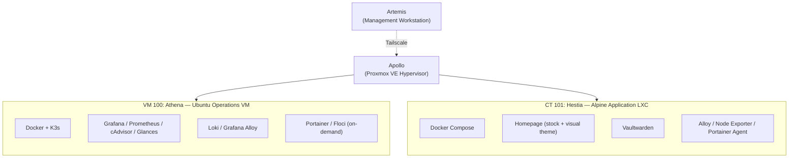
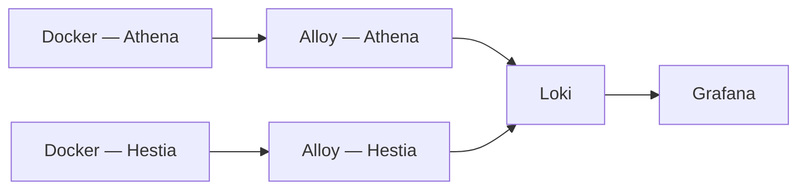
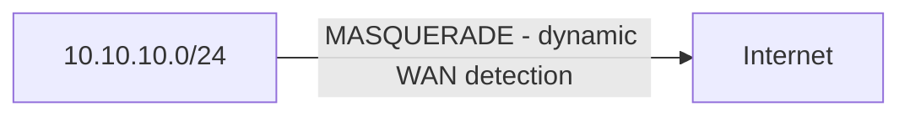

# Infrastructure Inventory

## Overview

This document serves as the authoritative inventory of the Olympus HomeLab environment. It documents all physical hardware, virtual infrastructure, containerized services, Kubernetes workloads, networking components, and operational assets.

The inventory acts as the single source of truth for infrastructure management, troubleshooting, capacity planning, and disaster recovery.

**Last audited against live systems:** 2026-07-18 (`docker ps -a`, `kubectl get pods -A`, hardware/network commands run directly on Apollo, Athena, and Hestia — see `postmortems.md` for the full audit log).

---

# Environment Summary

| Category | Count | Status |
|----------|------:|--------|
| Physical Nodes | 2 | Healthy |
| Hypervisors | 1 | Operational |
| Virtual Machines | 1 | Healthy |
| LXC Containers | 1 | Healthy |
| Docker Services (Athena) | 10 running (+ 1 exited leftover) | Operational |
| Docker Services (Hestia) | 5 running | Operational |
| Kubernetes Cluster | 1 | Healthy |
| Kubernetes Pods | 5 | Running |
| Monitoring Components | 7 | Healthy |
| Self-Hosted Applications | 2 | Operational |

---

# Infrastructure Topology



---

# Physical Infrastructure

## Apollo

**Role:** Primary Infrastructure Host

| Property | Value |
|----------|-------|
| Platform | Proxmox VE 9.2.2 |
| Type | Type-1 Hypervisor |
| Board | MSI MS-7C37 |
| Status | Healthy |

### Hardware Specification

| Component | Detail |
|-----------|--------|
| CPU | AMD Ryzen 7 3700X — 8 cores / 16 threads, up to 4.43GHz boost |
| Virtualization | AMD-V enabled |
| RAM | 16GB DDR4 @ 3200MT/s (single stick — 3 of 4 DIMM slots free, room to expand) |
| Storage — NVMe | 238.5GB — hosts the Proxmox LVM-thin pool (69.2GB root, ~141GB thin pool for guest disks) |
| Storage — SATA | 232.9GB — mounted separately as the `Storage` directory pool |
| GPU | NVIDIA GeForce GTX 1660 Super (running `nouveau`, **not** passed through to any guest — idle, candidate for future PCIe passthrough) |

### Storage Pools (`pvesm status`)

| Pool | Type | Total | Used | Available |
|------|------|------:|-----:|----------:|
| `Storage` | dir | 239GB | 11.8GB | 215GB |
| `local` | dir | 70.9GB | 5.2GB | 62GB |
| `local-lvm` | lvmthin | 147.7GB | 26.9GB | 120.8GB |

### Responsibilities

- Virtual Machine Hosting
- LXC Hosting
- Storage Management
- Virtual Networking
- Persistent NAT Gateway
- DNAT Port Forwarding
- Bridge Management (`vmbr0`)

> **Firewall architecture:** NAT/firewall logic is managed by a dedicated script (`/usr/local/sbin/apollo-firewall.sh`), run via a `systemd` unit at boot, with dynamic WAN interface detection rather than a hardcoded interface name. `nftables` was evaluated (Proxmox 9 ships with it) and explicitly declined — Apollo runs the `iptables-legacy` backend, fully independent from `nftables`, and Tailscale/Docker/K3s all already manage their own `iptables` chains. Full detail in `network.md` and `postmortems.md` (2026-07-18).

### Hosted Workloads

| ID | Workload | Type |
|----|----------|------|
| 100 | Athena | Ubuntu VM |
| 101 | Hestia | Alpine LXC |

---

## Artemis

**Role:** Management Workstation

| Property | Value |
|----------|-------|
| Platform | Arch Linux |
| Type | Physical Laptop |
| Status | Healthy |

### Responsibilities

- SSH Administration
- kubectl Management
- Terraform Operations
- Git Repository Management
- Documentation
- Remote Infrastructure Management
- Browser Access to Internal Services

---

# Virtual Infrastructure

## Athena (VM 100)

**Role:** Operations, Observability & Kubernetes Platform

| Property | Value |
|----------|-------|
| OS | Ubuntu Server 20.04.6 LTS |
| CPU | 4 cores |
| RAM | 3.8GB total |
| Disk | 32GB (30GB root, ~52% used) |
| Runtime | Docker Compose + K3s |
| LAN IP | `10.10.10.10` (`ens18`, netplan-managed) |
| Status | Healthy |

### Key Configuration

- cgroup v2 Enabled
- Docker Compose Runtime
- Single-node K3s Cluster
- Infrastructure Automation Host

### Hosted Services (live, `docker ps -a`)

| Service | Container | Port | Purpose |
|---------|-----------|------|---------|
| Grafana | `grafana` | 3001 | Dashboards & Alerting |
| Prometheus | `prometheus` | 9090 | Metrics Collection |
| Loki | `loki` | 3100 | Log Aggregation |
| Grafana Alloy | `alloy` | 12345 | Log Collection |
| Node Exporter | `node-exporter` | 9100 | System Metrics |
| Proxmox Exporter | `proxmox-exporter` | 9221 | Hypervisor Metrics |
| cAdvisor | `cadvisor` | 8080 | Per-container resource metrics |
| Glances | `glances` | host network | System monitor (top/htop-style) |
| Portainer | `portainer` | 9443 | Container Management (orphaned Compose project — see note below) |
| K3s Control Plane | — | 6443 | Kubernetes API |
| Floci | `floci_aws` | 4566 | AWS Emulation — **on-demand only, not always running** |

> **Note — orphaned `core-services` project:** the `portainer` container reports Compose project `core-services`, but no matching `docker-compose.yml` exists anywhere on Athena's filesystem (`docker compose -p core-services config` returns "no configuration file provided"). Portainer itself is healthy and running; the compose file that originally defined it is simply missing. See `troubleshooting.md`.

> **Note — Floci is on-demand.** Unlike the rest of the stack, Floci is intentionally started only when doing AWS-emulation/Terraform work, not left running continuously. Treat "not running" as expected, not a fault, when checking `docker ps`.

> **Note — LocalStack retained but unused.** `docker-compose/localstack/` and its `localstack_data/` (including old TLS certs) remain on disk from before the migration to Floci. Kept for reference; not part of the active stack.

> **Note — leftover exited container:** `floci-ec2-i-e4801109500e83d3a` (an Amazon Linux container Floci previously used to emulate an EC2 instance) is present but exited — safe to remove, harmless to leave.

## Hestia (CT 101)

**Role:** Frontend Application Platform

| Property | Value |
|----------|-------|
| OS | Alpine Linux |
| CPU | 1 core |
| RAM | 512MB |
| Disk | 8GB |
| Runtime | Docker Compose |
| LAN IP | `10.10.10.2` |
| Unprivileged | Yes |
| Tailscale | Disabled |
| Status | Healthy |

> Hestia is intentionally isolated from the Tailscale mesh and is accessible only through Apollo's port forwarding rules.

### Hosted Services (live, `docker ps -a`)

| Service | Container | Port | Purpose |
|---------|-----------|------|---------|
| Homepage | `homepage` | 3000 | Infrastructure Dashboard — stock service-discovery + custom visual theme (see note) |
| Vaultwarden | `vaultwarden` | 8080 → 80 (HTTPS internally) | Password Management |
| Grafana Alloy | `alloy` | 12345 | Per-host log collection, forwards to Loki on Athena |
| Node Exporter | `node-exporter` | — | Per-host system metrics |
| Portainer Agent | `portainer_agent` | 9001 | Lets Athena's central Portainer manage Hestia's containers remotely |

> **Correction from earlier documentation:** Hestia was previously documented as running only Homepage + Vaultwarden. The live audit confirms it also runs its own Alloy, Node Exporter, and Portainer Agent — a per-host exporter/agent pattern reporting up to the centralized Prometheus/Loki/Portainer on Athena. This is the accurate topology going forward.

> **Homepage note:** `custom.js` exists but is confirmed **empty** — the old data-widget logic is fully gone. `custom.css` is a real, active stylesheet, but it's pure visual theming (card border-radius, hover animations, scrollbar styling, header subtitle) with no data-fetching logic — kept intentionally as a lightweight visual layer, not a leftover to clean up. Homepage's `KUBECONFIG` mount and `HOMEPAGE_ALLOWED_HOSTS=*` env var enable its native, built-in Kubernetes/Docker/Proxmox widgets — a stock Homepage feature, not custom code.

---

# Kubernetes Inventory

## K3s Cluster

| Property | Value |
|----------|-------|
| Distribution | K3s |
| Version | v1.35.5+k3s1 |
| Topology | Single Node |
| Host | Athena |
| Node OS | Ubuntu 20.04.6 LTS |
| Kernel | 5.4.0-216-generic |
| Container Runtime | containerd 2.2.3-k3s1 |
| Status | Healthy (26+ days uptime) |

### Running Workloads (live, `kubectl get pods -A`)

| Namespace | Pod | Purpose |
|-----------|-----|---------|
| `kube-system` | `coredns` | Cluster DNS |
| `kube-system` | `local-path-provisioner` | Default storage class |
| `kube-system` | `metrics-server` | Resource metrics API |
| `kube-system` | `svclb-portainer-agent` | LoadBalancer service helper |
| `portainer` | `portainer-agent` | Portainer cluster management agent |

> **Correction:** Traefik is **not** deployed in this cluster. Earlier documentation (`postmortems.md`, 2026-06-21) noted it was kept "for learning Ingress" — that never materialized or was later removed; either way, it isn't part of the current cluster and shouldn't be listed as a running component.

### RBAC

Homepage's native Kubernetes widget authenticates against the cluster using a dedicated, purpose-built `ClusterRole` (`homepage-readonly`, defined in `homepage-rbac.yaml` on Athena): read-only (`get`/`list`/`watch`) access to core resources, workloads, batch jobs, networking objects, and metrics — no write access anywhere. A clean example of least-privilege scoping.

### Management

Remote administration is performed from Artemis using:

```bash
kubectl
```

The Kubernetes API is accessed through Athena's LAN IP (`10.10.10.10`) to match the certificate SANs — the Tailscale IP is not covered by the K3s-issued certificate (see `postmortems.md`, 2026-06-21).

> **Known caveat:** the `chmod 644` workaround applied to `/etc/rancher/k3s/k3s.yaml` for passwordless local `kubectl` access does **not** persist across `k3s` service restarts — K3s regenerates that file with restrictive permissions on every restart. Use `sudo kubectl` on Athena itself, or reapply the `chmod` after restarts, until this is automated.

---

# Monitoring & Observability

## Grafana

**Purpose**

- Dashboards
- Metrics Visualization
- Log Exploration
- Alerting

**Status:** Healthy

---

## Prometheus

**Purpose**

- Metrics Collection
- Time-Series Database
- Alert Evaluation

### Monitored Targets

- Node Exporter (Athena + Hestia)
- Proxmox Exporter
- cAdvisor
- Docker Services
- K3s Components

**Status:** Healthy

---

## Loki

**Purpose**

- Centralized Log Storage
- Log Search
- Historical Retention

**Status:** Healthy — full ingestion confirmed.

---

## Grafana Alloy

**Purpose**

- Docker Log Discovery (runs on both Athena and Hestia, forwarding to the central Loki on Athena)
- Log Collection
- Log Forwarding

**Pipeline**



**Status:** Healthy. The Docker log discovery gap previously tracked here (only 2 of 9 containers ingested, opened 2026-07-05) is **resolved** — a live query against Loki on 2026-07-18 confirmed all 12 running containers across both hosts are being ingested (`alloy, cadvisor, glances, grafana, homepage, loki, node-exporter, portainer, portainer_agent, prometheus, proxmox-exporter, vaultwarden`). Full resolution note in `postmortems.md`.

---

## Node Exporter

**Metrics**

- CPU
- Memory
- Disk
- Filesystem
- Network

**Runs on:** Athena and Hestia (per-host)

**Status:** Healthy

---

## Proxmox Exporter

**Metrics**

- Hypervisor
- Virtual Machines
- Containers
- Storage
- CPU
- Memory

**Status:** Healthy

---

## cAdvisor

**Metrics**

- Per-container CPU/memory/network/disk usage

**Runs on:** Athena

**Status:** Healthy

---

## Glances

**Purpose**

- Lightweight system monitor (top/htop-style), web/API accessible

**Runs on:** Athena

**Status:** Healthy

---

# Application Inventory

## Homepage

| Property | Value |
|----------|-------|
| Host | Hestia |
| Port | 3000 |
| Access | DNAT via Apollo |

### Features

- Stock service-discovery dashboard (native Docker/Kubernetes/Proxmox widgets)
- Custom visual theme (`custom.css`) — border radius, hover animation, header subtitle, scrollbar styling only
- `custom.js` present but empty — no custom data-fetching logic
- No external Dashboard API dependency

Homepage previously ran a heavily customized "Olympus" data widget backed by a dedicated Dashboard API on Athena. Both were decommissioned from active deployment; the Dashboard API's code is intentionally retained in the repository (`docker-compose/dashboard-api/`) as a portfolio reference rather than deleted. See "Decommissioned Components" below.

---

## Vaultwarden

| Property | Value |
|----------|-------|
| Host | Hestia |
| Port | 8080 |
| Protocol | HTTPS Only |

### Notes

- Persistent Storage (SQLite, icon cache)
- Password Management
- Accessible only through Apollo port forwarding
- Serves HTTPS internally on port 80 (`ROCKET_TLS`) — always connect with `https://`, not `http://` (see `troubleshooting.md`)
- `SIGNUPS_ALLOWED=false`, WebSocket support enabled

---

## Portainer

| Property | Value |
|----------|-------|
| Host | Athena |
| Port | 9443 |
| Compose Project | `core-services` (orphaned — see K3s/Athena note above) |

### Responsibilities

- Docker Management (Athena + Hestia via Portainer Agent)
- Kubernetes Visibility (via Portainer Agent in K3s)
- Container Monitoring

---

## Floci

| Property | Value |
|----------|-------|
| Host | Athena |
| Port | 4566 |
| Usage Pattern | On-demand — started only for AWS-emulation/Terraform work, not left running |

### Services

- Amazon S3
- DynamoDB
- EC2 (emulated instances)

**Purpose:** Local AWS emulation for Terraform development. Superseded LocalStack (still present on disk, unused — see Athena note above).

---

# Decommissioned Components

| Component | Host | Status | Reason |
|-----------|------|--------|--------|
| Olympus Dashboard API (FastAPI) | Athena | Decommissioned from deployment 2026-07-10 — **code retained in repo** (`docker-compose/dashboard-api/`) as a portfolio reference | Too much operational overhead for the value provided once the frontend widget was retired |
| Custom Homepage data-widget JS | Hestia | Removed (`custom.js` now empty) 2026-06-27 | Fragile, tightly coupled to Homepage internals, broke on mobile |
| Fetch scripts + cron jobs (LastFM, weather, prices, Pokémon, media, anime) | Athena | Removed 2026-07-10 | Only existed to feed the Dashboard API |
| Traefik (K3s Ingress) | Athena | Never deployed / removed | Not currently in the cluster; was noted as a future learning item but never materialized |
| LocalStack | Athena | Superseded by Floci — files retained, not in use | Replaced by a lighter-weight AWS emulator |

Full narrative in `postmortems.md`.

---

# Networking Inventory

## Internal Network

| Component | Value |
|----------|-------|
| LAN Subnet | `10.10.10.0/24` |
| Gateway | Apollo |
| Bridge | `vmbr0` |
| Outbound Uplink | `wlx002e2df0393b` (Wi-Fi) — confirmed via live `ip route` |

---

## Tailscale Mesh

### Connected Nodes

| Node | Type | Status |
|------|------|--------|
| Artemis | Laptop | Active |
| Apollo | Hypervisor | Active |
| Athena | VM | Active |
| xa-12 | Android phone | Typically offline (not part of routine infra operations) |

> Hestia is intentionally **not** on the Tailscale mesh — see Service Isolation below.

### Purpose

- Secure Remote Administration
- SSH Access
- kubectl Management
- Web UI Access

---

## NAT Gateway (Apollo)

### Outbound NAT

Provides internet access for internal workloads via MASQUERADE, with the outbound interface detected **dynamically** at boot (`ip route | awk '/^default/ {print $5; exit}'`) rather than hardcoded — this is the currently-Wi-Fi-bound interface (`wlx002e2df0393b`), but the script adapts automatically if the uplink ever changes to Ethernet or USB tethering.



Managed by `/usr/local/sbin/apollo-firewall.sh` + `apollo-firewall.service`. See `network.md` and `postmortems.md` (2026-07-18) for the full architecture and the incident that led to it.

---

### Inbound Port Forwarding

| External Port | Destination | Service |
|--------------:|------------|---------|
| 3000 | Hestia | Homepage |
| 8080 | Hestia | Vaultwarden (HTTPS) |

---

## Kubernetes Networking

| Component | Value |
|----------|-------|
| API Port | 6443 |
| Access Method | Athena LAN IP |
| Cluster Type | Single Node |

---

# Security Inventory

## Remote Access

- Tailscale Zero-Trust Network
- SSH Key Authentication
- No Public SSH Exposure

---

## Secrets Management

- No `.env` files exist anywhere in the environment (confirmed via audit across all three hosts, 2026-07-18) — all configuration values are inline in Compose files.
- No secrets-externalization layer (e.g., SOPS, Vault) currently in place — see `HOMELAB_ROADMAP.md` Phase 10 for a suggested future improvement.

---

## Service Isolation

- Hestia excluded from Tailscale
- Frontend accessible only through Apollo
- Internal services remain on the private LAN
- Homepage's Kubernetes access is scoped to a dedicated read-only `ClusterRole`

---

# Recovery Readiness

| Component | Status |
|----------|--------|
| VM Autostart | Enabled |
| LXC Autostart | Enabled |
| Disaster Recovery Runbook | Complete |
| Health Verification Guide | Complete |
| Infrastructure Validation | Complete |
| NAT Persistence Documented | Yes — via dedicated firewall script + `systemd` unit |
| Operational Documentation | Complete |

---

# Operational Status

| Component | Status |
|----------|--------|
| Apollo | Healthy |
| Artemis | Healthy |
| Athena | Healthy |
| Hestia | Healthy |
| Kubernetes | Healthy |
| Grafana | Healthy |
| Prometheus | Healthy |
| Loki | Healthy — full ingestion confirmed |
| Grafana Alloy | Healthy (both hosts) |
| Homepage | Healthy |
| Vaultwarden | Healthy |
| Portainer | Healthy (orphaned Compose project — see note) |
| Floci | Healthy when started (on-demand) |
| Network Routing | Operational — dynamic firewall script in place |
| Observability | Fully Operational |

---

# Summary

The Olympus HomeLab consists of a production-inspired virtualized environment built around Proxmox VE, Docker, and K3s. Infrastructure responsibilities are distributed between Athena (operations, observability, and Kubernetes) and Hestia (a minimal, stock-plus-themed frontend, with its own local monitoring/agent footprint), while Apollo provides virtualization, networking, and gateway services on real hardware with meaningful headroom (16GB RAM, only 1 of 4 DIMM slots populated; an idle GPU available for future passthrough).

The environment includes fully-working centralized monitoring and logging across both hosts, Infrastructure as Code workflows, secure remote administration through Tailscale, and comprehensive operational documentation covering architecture, recovery, validation, troubleshooting, and health verification. The most recent infrastructure change was reworking Apollo's NAT/firewall layer into a dedicated, idempotent script with dynamic WAN detection, after root-causing a real outage to a hardcoded interface name — `nftables` was evaluated as part of that work and explicitly declined.

**Overall Infrastructure Status:** Healthy and Operational

**Operational Readiness:** Fully Validated
