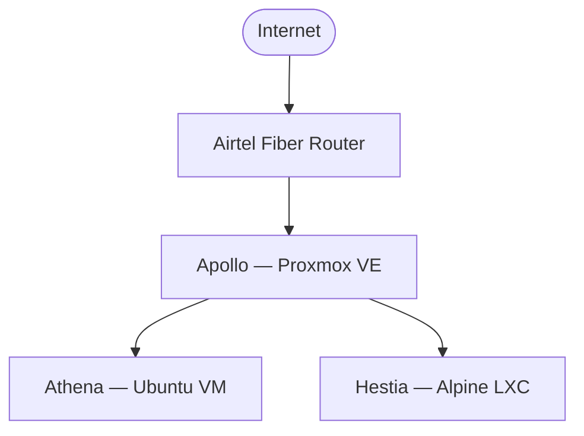
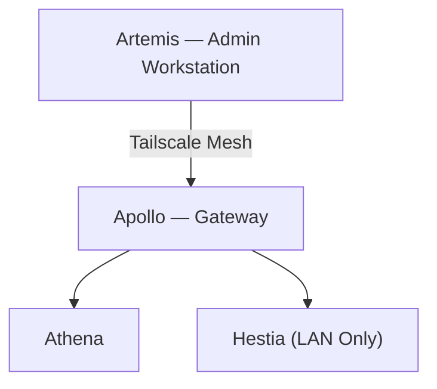

# Network Architecture

## Overview

The Olympus HomeLab network follows a **private-by-default** architecture designed to provide secure remote administration, reliable inter-node communication, and minimal external exposure.

All infrastructure services operate on an isolated internal network, with administrative access secured through a Tailscale mesh. Only explicitly approved services are reachable through Apollo's controlled routing.

### Design Goals

- Private-by-default networking
- Secure remote administration
- Reliable internal communication
- Minimal external exposure
- Service isolation
- Operational resilience

---

# Network Topology

## Physical Topology



---

## Logical Topology



---

## Infrastructure Flow

```text
Artemis
TS: 100.100.252.87
        │
        │ WireGuard Tunnel
        ▼
Apollo
LAN: 10.10.10.1
TS : 100.81.86.51
        │
        ├──────── vmbr0 ────────┐
        │                       │
        ▼                       ▼
Athena                  Hestia
LAN: 10.10.10.10        LAN: 10.10.10.2
TS : 100.117.35.70      TS: None

Services:               Services:
• Grafana               • Homepage (stock+theme)
• Prometheus            • Vaultwarden
• Loki                  • Grafana Alloy
• Grafana Alloy         • Node Exporter
• cAdvisor / Glances    • Portainer Agent
• K3s
• Portainer
• Floci (on-demand)
```

> **Firewall architecture note:** Apollo's NAT/firewall rules were previously embedded inline in `/etc/network/interfaces` with a hardcoded WAN interface name. As of 2026-07-18, this has been replaced with a dedicated, idempotent script (`/usr/local/sbin/apollo-firewall.sh`) run via `systemd` at boot, which detects the WAN interface dynamically rather than hardcoding it. `nftables` was evaluated as part of this rework and explicitly declined — see below and `postmortems.md`.

---

# Network Inventory

| Node | Type | LAN Address | Tailscale | Role |
|------|-------------|-------------|------------|---------------------------|
| Artemis | Physical Workstation | Dynamic | `100.100.252.87` | Administration |
| Apollo | Proxmox Hypervisor | `10.10.10.1` | `100.81.86.51` | Compute & Gateway |
| Athena | Ubuntu VM | `10.10.10.10` | `100.117.35.70` | Operations & K3s |
| Hestia | Alpine LXC | `10.10.10.2` | None | Frontend Services |

---

# Virtual Networking

The internal network is built on Proxmox's **vmbr0** bridge.

### Responsibilities

- VM connectivity
- LXC connectivity
- Internal service communication
- Internet access through Apollo
- Kubernetes communication

All virtual workloads communicate over the `10.10.10.0/24` subnet.

---

# Remote Access

Remote administration is provided through a Tailscale mesh.

## Connected Nodes

| Node | Status |
|------|--------|
| Artemis | Active |
| Apollo | Active |
| Athena | Active |
| Personal Android device | Typically offline — not part of routine infra operations |

### Benefits

- End-to-end WireGuard encryption
- Device authentication
- No public SSH exposure
- Secure Proxmox administration
- Remote infrastructure management

Hestia is intentionally excluded from the Tailscale network to reduce the attack surface for user-facing applications.

> **Access pattern clarification (found 2026-07-26):** Apollo is **not** configured as a Tailscale subnet router, so SSH from Artemis to Athena's LAN IP (`10.10.10.10`) over Tailscale does not work — that's expected, not a bug. Use Athena's own Tailscale IP (`100.117.35.70`) directly, or SSH ProxyJump through Apollo's Tailscale IP (`100.81.86.51`).

---

# NAT & Traffic Routing

Apollo functions as the network gateway for the homelab. As of 2026-07-18, all NAT/firewall logic is managed by a dedicated script rather than being embedded in network configuration files.

## Firewall Architecture

| Property | Value |
|----------|-------|
| Script | `/usr/local/sbin/apollo-firewall.sh` |
| Managed by | `systemd` — `/etc/systemd/system/apollo-firewall.service` |
| Trigger | Runs at boot, after `network-online.target` |
| Enabled via | `systemctl enable apollo-firewall.service` |
| Boot-time resilience | Script retries `ip route` lookup every 2s, up to 15 times (30s total), before failing; `systemd` additionally retries the whole service every 10s on failure (`Restart=on-failure`, `RestartSec=10s`) |
| Verified state | `Active: active (exited)` |
| Idempotency | Checks for existing rules before adding them — safe to re-run manually at any time |

> **Why the retry logic:** the original version of this service ran once, checked for a default route, and gave up immediately if none existed yet — which failed twice in practice (2026-07-26/27, then again 2026-07-31) because Wi-Fi association/DHCP can complete *after* systemd considers networking "online." See `postmortems.md` (2026-07-26→31) for the full incident and why a single ordering directive (`network-online.target` alone) wasn't sufficient on its own.

The script is responsible for:

- Outbound NAT (dynamic WAN detection)
- Homepage and Vaultwarden port forwarding
- Hairpin NAT (so LAN clients can reach forwarded services via Apollo's own address, not just external clients)

It explicitly does **not** touch Tailscale's chains, Docker's rules, or K3s/Flannel's networking rules — those are left to their own tooling to avoid conflicts. `/etc/network/interfaces` now only configures networking; no firewall logic lives there anymore.

## Why Not `nftables`?

Proxmox 9 ships with `nftables`, and a migration was evaluated. It was declined once Apollo's `iptables` was confirmed to be running the **legacy** backend (`iptables v1.8.11 (legacy)`) — which maintains a completely independent rule set from `nftables`, not a shared one. Migrating would have meant either running two disconnected firewalls, or also migrating Tailscale's, Docker's, and K3s's self-managed `iptables` chains — well outside the scope of what was actually broken (a single stale interface name). Full reasoning: `postmortems.md` (2026-07-18).

## Outbound NAT

Internal systems access the internet through a MASQUERADE rule whose interface is determined **dynamically at boot**, rather than hardcoded:

```bash
WAN_IF=$(ip route | awk '/^default/ {print $5; exit}')
iptables -t nat -A POSTROUTING -s 10.10.10.0/24 -o "$WAN_IF" -j MASQUERADE
```

This directly fixes the root cause of a real outage: Apollo's uplink had previously changed from USB tethering (`enx4a7f6c52f9f5`) back to Wi-Fi (`wlx002e2df0393b`), but the old hardcoded MASQUERADE rule was never updated — so outbound traffic from Athena silently stopped being NAT'd. The script now adapts automatically across Wi-Fi, Ethernet, or USB tethering, instead of going stale the next time the connection type changes. Full incident writeup: `postmortems.md` (2026-07-18).

This enables:

- Package updates
- External API access
- Container image downloads
- General internet connectivity

---

## Inbound Port Forwarding

Only approved services are forwarded to the internal network.

```bash
iptables -t nat -A PREROUTING -p tcp --dport 3000 -j DNAT --to-destination 10.10.10.2:3000
iptables -t nat -A PREROUTING -p tcp --dport 8080 -j DNAT --to-destination 10.10.10.2:8080
```

| External | Internal |
|----------|----------|
| Apollo:3000 | Hestia:3000 (Homepage) |
| Apollo:8080 | Hestia:8080 (Vaultwarden) |

Vaultwarden requires HTTPS at the application layer and will reject plain HTTP connections.

### Return-Path NAT & Hairpin NAT

`apollo-firewall.sh` configures return-path MASQUERADE for **both** forwarded ports symmetrically:

```bash
iptables -t nat -A POSTROUTING -d 10.10.10.2 -p tcp --dport 3000 -j MASQUERADE
iptables -t nat -A POSTROUTING -d 10.10.10.2 -p tcp --dport 8080 -j MASQUERADE
```

This resolves an asymmetry noted in an earlier audit, where port 8080's return-path rule was consistently present in the live NAT table but port 3000's wasn't. The script also configures **hairpin NAT**, so LAN clients can reach Homepage/Vaultwarden through Apollo's own address (not just external clients reaching in) — something the previous inline configuration didn't explicitly provide.

All of this now survives host reboots via the `systemd` unit rather than `post-up`/`post-down` hooks in `/etc/network/interfaces`.

---

# Kubernetes Networking

Athena hosts a single-node K3s cluster.

## Networking Characteristics

- API Server: **6443**
- No Ingress controller (Traefik) currently deployed — NodePort services used for exposing test workloads
- Internal LAN communication
- Certificate SANs bound to Athena's LAN IP

Remote `kubectl` access must use Athena's LAN address (`10.10.10.10`) because the cluster certificates are issued for the LAN interface rather than the Tailscale address.

---

# Network Traffic

## Metrics

```text
Node Exporter
        │
        ▼
Prometheus
        │
        ▼
Grafana
```

Collects infrastructure metrics from hosts and services.

---

## Logging

```text
Containers
      │
      ▼
Grafana Alloy
      │
      ▼
Loki
      │
      ▼
Grafana
```

Provides centralized log collection and historical analysis.

---

## Alerting

```text
Prometheus
      │
      ▼
Grafana Alerting
      │
      ▼
Telegram
```

Monitors infrastructure health and service availability.

---

## Homepage (Decommissioned Dashboard API)

Homepage previously consumed a custom Dashboard API on Athena (`10.10.10.10:8000`) that aggregated data from external services. That API, its fetch scripts, and their cron jobs have been decommissioned from active deployment — Homepage on Hestia now runs standalone in its stock configuration (plus an unrelated lightweight visual theme) with no backend dependency. The Dashboard API's code is retained in the repository as a portfolio reference rather than deleted. See `architecture.md` and `postmortems.md` for the full history.

---

# Connectivity Validation

Routine network validation follows a fixed troubleshooting sequence.

| Step | Validation |
|------|------------|
| 1 | Ping Apollo (`10.10.10.1`) |
| 2 | Ping `8.8.8.8` |
| 3 | `curl -I https://google.com` |
| 4 | `tailscale status` |
| 5 | Verify LAN connectivity between nodes |
| 6 | If outbound internet fails specifically: confirm `apollo-firewall.service` is `active (exited)` and re-run `/usr/local/sbin/apollo-firewall.sh` manually if needed |

This progression quickly isolates failures involving local networking, internet connectivity, DNS, Tailscale, internal routing, or a stale/misapplied firewall rule.

---

# Security Model

The network follows a defense-in-depth approach.

## Principles

- Private-by-default networking
- No unnecessary public exposure
- Device-authenticated administration
- Encrypted WireGuard tunnels
- Internal service communication
- Controlled ingress through Apollo
- Reduced attack surface through workload isolation

---

# Operational Status

| Component | Status |
|----------|--------|
| vmbr0 Bridge | Operational |
| Internal Networking | Operational |
| Tailscale Mesh | Operational |
| Remote Administration | Operational |
| Apollo Firewall Script (`apollo-firewall.service`) | Operational — `active (exited)` |
| Outbound NAT | Persistent — dynamic WAN detection |
| Port Forwarding | Operational — symmetric return-path + hairpin NAT |
| Kubernetes Networking | Operational |
| Metrics Pipeline | Operational |
| Logging Pipeline | Operational — full container discovery confirmed across both hosts |
| Alerting Pipeline | Operational |

---

# Current State

The Olympus HomeLab network provides a secure, resilient, and production-inspired foundation for infrastructure experimentation. Apollo acts as the central gateway, enforcing routing and network isolation, while Tailscale enables encrypted remote administration without exposing management interfaces to the public internet. The architecture supports observability, Kubernetes, and self-hosted applications while maintaining a minimal attack surface and operational simplicity.

Apollo's NAT/firewall layer was reworked on 2026-07-18 following a real outage root-caused to a stale, hardcoded interface reference. `nftables` was evaluated as a fix and explicitly declined — Apollo runs `iptables-legacy`, which is fully independent from `nftables`, and Tailscale/Docker/K3s all already manage their own `iptables` state. Instead, firewall logic now lives in a dedicated, idempotent script with dynamic WAN interface detection, managed by its own `systemd` unit. That fix recurred twice more (2026-07-26/27, 2026-07-31) due to a boot-time race condition before it was fully hardened with a script-level retry loop and `systemd` auto-recovery. See `postmortems.md` for the full incident and decision record.