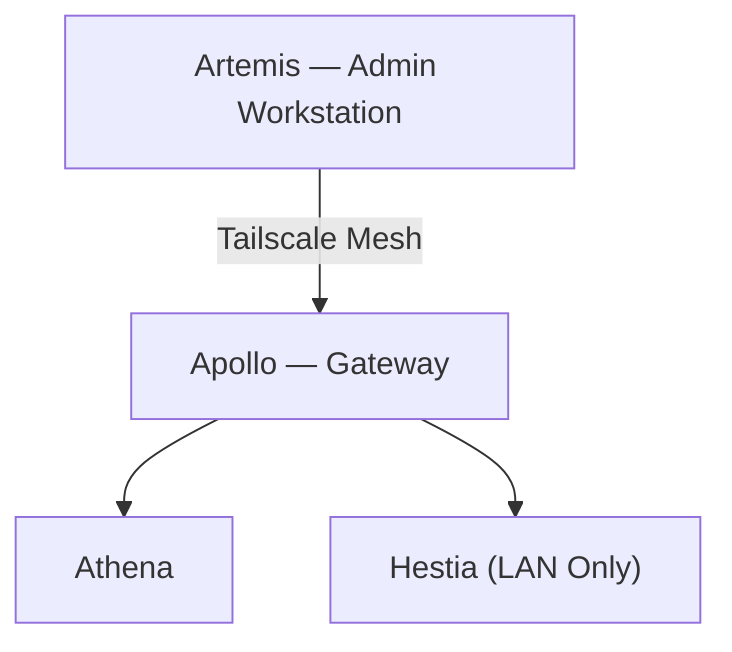

# Network Architecture

## Overview

The Olympus HomeLab network follows a **private-by-default** architecture designed to provide secure remote administration, reliable inter-node communication, and minimal external exposure.

All infrastructure services operate on an isolated internal network, with administrative access secured through a Tailscale mesh. Only explicitly approved services are reachable through Apollo's controlled routing.

### Design Goals

- Private-by-default networking
- Secure remote administration
- Reliable internal communication
- Minimal external exposure
- Service isolation
- Operational resilience

---

# Network Topology

## Physical Topology


---

## Logical Topology



---

## Infrastructure Flow

```text
Artemis
TS: 100.100.252.87
        │
        │ WireGuard Tunnel
        ▼
Apollo
LAN: 10.10.10.1
TS : 100.81.86.51
        │
        ├──────── vmbr0 ────────┐
        │                       │
        ▼                       ▼
Athena                  Hestia
LAN: 10.10.10.10        LAN: 10.10.10.2
TS : 100.117.35.70      TS: None

Services:               Services:
• Grafana               • Homepage (stock)
• Prometheus            • Vaultwarden
• Loki
• Grafana Alloy
• K3s
• Portainer
• Floci
```

---

# Network Inventory

| Node | Type | LAN Address | Tailscale | Role |
|------|-------------|-------------|------------|---------------------------|
| Artemis | Physical Workstation | Dynamic | `100.100.252.87` | Administration |
| Apollo | Proxmox Hypervisor | `10.10.10.1` | `100.81.86.51` | Compute & Gateway |
| Athena | Ubuntu VM | `10.10.10.10` | `100.117.35.70` | Operations & K3s |
| Hestia | Alpine LXC | `10.10.10.2` | None | Frontend Services |

---

# Virtual Networking

The internal network is built on Proxmox's **vmbr0** bridge.

### Responsibilities

- VM connectivity
- LXC connectivity
- Internal service communication
- Internet access through Apollo
- Kubernetes communication

All virtual workloads communicate over the `10.10.10.0/24` subnet.

---

# Remote Access

Remote administration is provided through a Tailscale mesh.

## Connected Nodes

- Artemis
- Apollo
- Athena

### Benefits

- End-to-end WireGuard encryption
- Device authentication
- No public SSH exposure
- Secure Proxmox administration
- Remote infrastructure management

Hestia is intentionally excluded from the Tailscale network to reduce the attack surface for user-facing applications.

---

# NAT & Traffic Routing

Apollo functions as the network gateway for the homelab.

## Outbound NAT

Internal systems access the internet through a persistent MASQUERADE rule.

```text
10.10.10.0/24
        │
        ▼
Apollo
        │
        ▼
Internet
```

This enables:

- Package updates
- External API access
- Container image downloads
- General internet connectivity

---

## Inbound Port Forwarding

Only approved services are forwarded to the internal network.

| External | Internal |
|----------|----------|
| Apollo:3000 | Hestia:3000 (Homepage) |
| Apollo:8080 | Hestia:8080 (Vaultwarden) |

Vaultwarden requires HTTPS at the application layer and will reject plain HTTP connections.

Persistent `iptables` rules ensure forwarding survives host reboots.

---

# Kubernetes Networking

Athena hosts a single-node K3s cluster.

## Networking Characteristics

- API Server: **6443**
- NodePort services for testing workloads
- Internal LAN communication
- Certificate SANs bound to Athena's LAN IP

Remote `kubectl` access must use Athena's LAN address (`10.10.10.10`) because the cluster certificates are issued for the LAN interface rather than the Tailscale address.

---

# Network Traffic

## Metrics

```text
Node Exporter
        │
        ▼
Prometheus
        │
        ▼
Grafana
```

Collects infrastructure metrics from hosts and services.

---

## Logging

```text
Containers
      │
      ▼
Grafana Alloy
      │
      ▼
Loki
      │
      ▼
Grafana
```

Provides centralized log collection and historical analysis.

---

## Alerting

```text
Prometheus
      │
      ▼
Grafana Alerting
      │
      ▼
Telegram
```

Monitors infrastructure health and service availability.

---

## Homepage (Decommissioned Dashboard API)

Homepage previously consumed a custom Dashboard API on Athena (`10.10.10.10:8000`) that aggregated data from external services. That API, its fetch scripts, and their cron jobs have been fully removed — Homepage on Hestia now runs standalone in its stock configuration with no backend dependency. See `architecture.md` and `postmortems.md` for the removal history.

---

# Connectivity Validation

Routine network validation follows a fixed troubleshooting sequence.

| Step | Validation |
|------|------------|
| 1 | Ping Apollo (`10.10.10.1`) |
| 2 | Ping `8.8.8.8` |
| 3 | `curl -I https://google.com` |
| 4 | `tailscale status` |
| 5 | Verify LAN connectivity between nodes |

This progression quickly isolates failures involving local networking, internet connectivity, DNS, Tailscale, or internal routing.

---

# Security Model

The network follows a defense-in-depth approach.

## Principles

- Private-by-default networking
- No unnecessary public exposure
- Device-authenticated administration
- Encrypted WireGuard tunnels
- Internal service communication
- Controlled ingress through Apollo
- Reduced attack surface through workload isolation

---

# Operational Status

| Component | Status |
|----------|--------|
| vmbr0 Bridge | Operational |
| Internal Networking | Operational |
| Tailscale Mesh | Operational |
| Remote Administration | Operational |
| Outbound NAT | Persistent |
| Port Forwarding | Operational |
| Kubernetes Networking | Operational |
| Metrics Pipeline | Operational |
| Logging Pipeline | Operational (partial container discovery — see `troubleshooting.md`) |
| Alerting Pipeline | Operational |

---

# Current State

The Olympus HomeLab network provides a secure, resilient, and production-inspired foundation for infrastructure experimentation. Apollo acts as the central gateway, enforcing routing and network isolation, while Tailscale enables encrypted remote administration without exposing management interfaces to the public internet. The architecture supports observability, Kubernetes, and self-hosted applications while maintaining a minimal attack surface and operational simplicity.