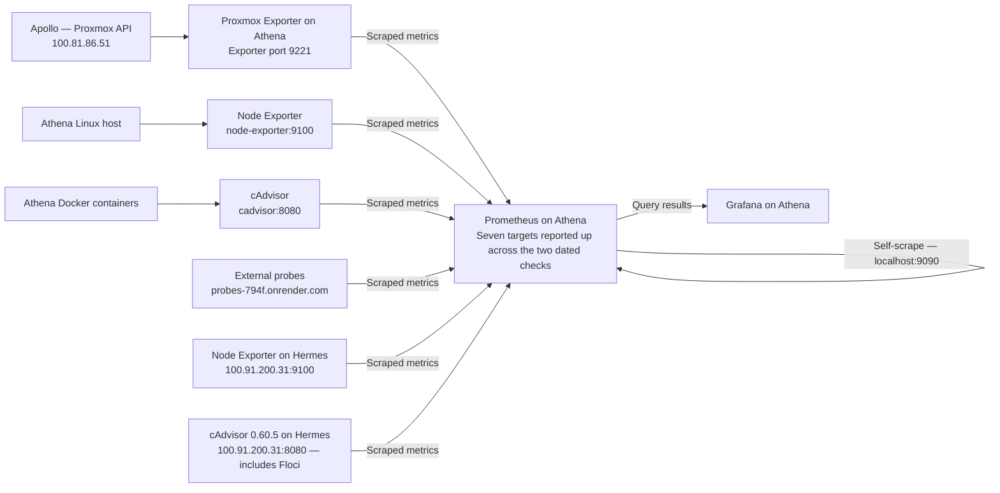
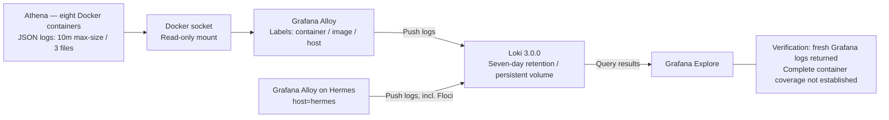
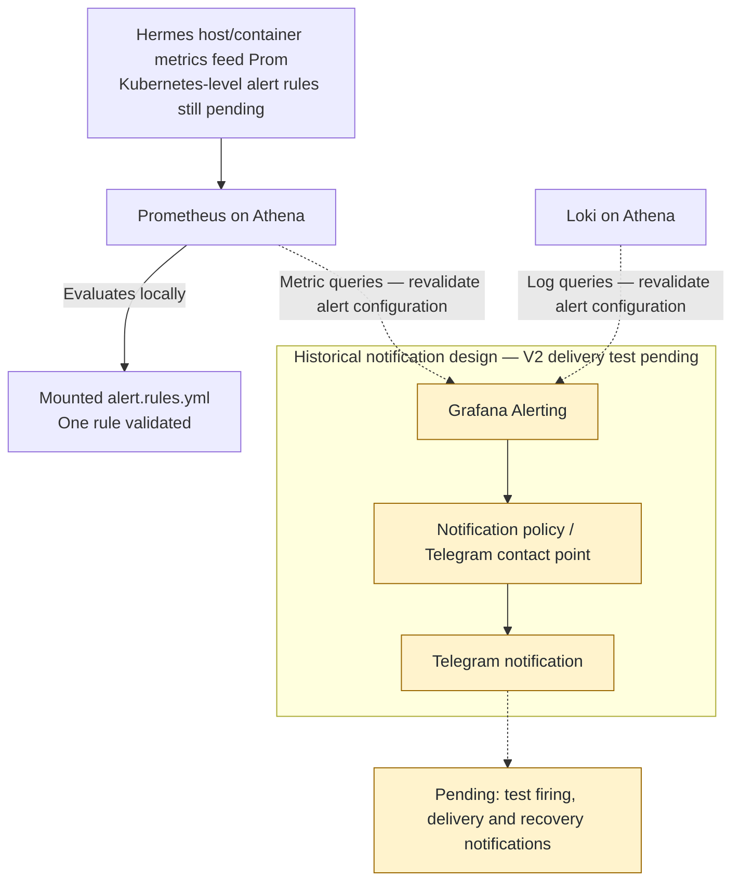

# V2 observability

Athena VM 100 is observability-only. The [September 12 rebuild report](history/rebuild-history.md) records eight running containers: Prometheus, Grafana, Loki, Alloy, Node Exporter, cAdvisor, Proxmox Exporter and Glances.

## Metrics and logs

The September 14 continuation adds two Hermes targets to the five reported on September 12.

| Prometheus job | Reported target / instance | Status |
|---|---|---|
| cadvisor | `cadvisor:8080` | up |
| node | `node-exporter:9100` | up |
| probes | `probes-794f.onrender.com` | up |
| prometheus | `localhost:9090` | up |
| proxmox | `100.81.86.51` | up |
| hermes | `100.91.200.31:9100` | up |
| hermes-cadvisor | `100.91.200.31:8080` | up |

Proxmox Exporter exposes metrics on port 9221 and queries Apollo; Apollo's address is the monitored instance, not necessarily the scrape URL. Hestia is absent from active targets; historical series were retained. **Hermes host/Docker metrics integration is reported complete as of 2026-09-14** — Node Exporter and a dedicated cAdvisor (`0.60.5`, separate from Athena's own `v0.49.1` instance) run directly on Hermes and are scraped by Athena's Prometheus over Tailscale. The Hermes cAdvisor was specifically upgraded from `v0.49.1` to `0.60.5` after the older version failed to expose Floci's container metrics (an `overlayfs` read-write-layer identification bug); the upgrade resolved it and Floci's `container_memory_usage_bytes` and related metrics are now confirmed flowing through.

Alloy discovers containers using the mounted Docker socket and labels logs with container, image and host. A Loki query for `{host="athena"}` returned fresh Grafana logs. This verifies that sample pipeline, not exhaustive per-container coverage. **Hermes's own Grafana Alloy instance** (installed as a systemd service, not a container, reading `unix:///var/run/docker.sock`) pushes to the same Athena Loki (`http://100.117.35.70:3100/loki/api/v1/push`) labeled `host="hermes"` — its Docker group membership (`usermod -aG docker alloy`) was needed for socket access, without weakening socket permissions or re-enabling Docker's TCP API. A `{host="hermes"}` query after restarting Floci returned 50 fresh log entries with correct `container`/`service_name` labels, confirming the Floci log path end-to-end.

## Configuration and retention

Recorded Athena host stack directory: `~/homelab/docker-compose/telemetry/`. The repository destination is [docker/telemetry/](../docker/telemetry/); its current host export is pending. Reorganizing this repository did not relocate the running stack.

- Prometheus: `prometheus/prometheus.yml`; alert rule file mounted read-only at `/etc/prometheus/alert.rules.yml`. Validation passed with one rule file and one rule; readiness passed.
- Loki 3.0.0: `loki/loki-config.yaml`; retention `168h`, compaction interval `10m`, deletion delay `2h`, filesystem delete-request store. Configuration validation and readiness passed after startup stabilization.
- Grafana: host port 3001 → container 3000; version `13.0.1+security-01`, database health `ok`.
- cAdvisor: `v0.49.1`, healthy. Glances intentionally listens on port 61208 with host networking/PID mode.
- Docker JSON logs: `max-size=10m`, `max-file=3`, applied through container recreation.
- Journald: `SystemMaxUse=200M`, `RuntimeMaxUse=50M`, `MaxRetentionSec=7day`.

Persistent volumes: `telemetry_grafana_data`, `telemetry_loki_data`, `telemetry_prometheus_data`. Full configuration excerpts, image tags and validation commands are in rebuild sections 25–50.

## Next validation

Hermes host/Docker metrics and the Floci Docker log path are reported verified (see above). Host journal and K3s/containerd workload log collection remain unverified. Remaining: improve dashboards and alerting, integrate Hermes's own Kubernetes-level metrics/alert rules (currently only host + Docker-container level), and test a controlled Hermes failure while Athena remains available. Earlier Grafana/Telegram alerting records are historical; the supplied V2 health checks do not include a fresh notification-delivery test. All guests share Apollo, so host failure can interrupt both workloads and telemetry.

## Alerting validation

