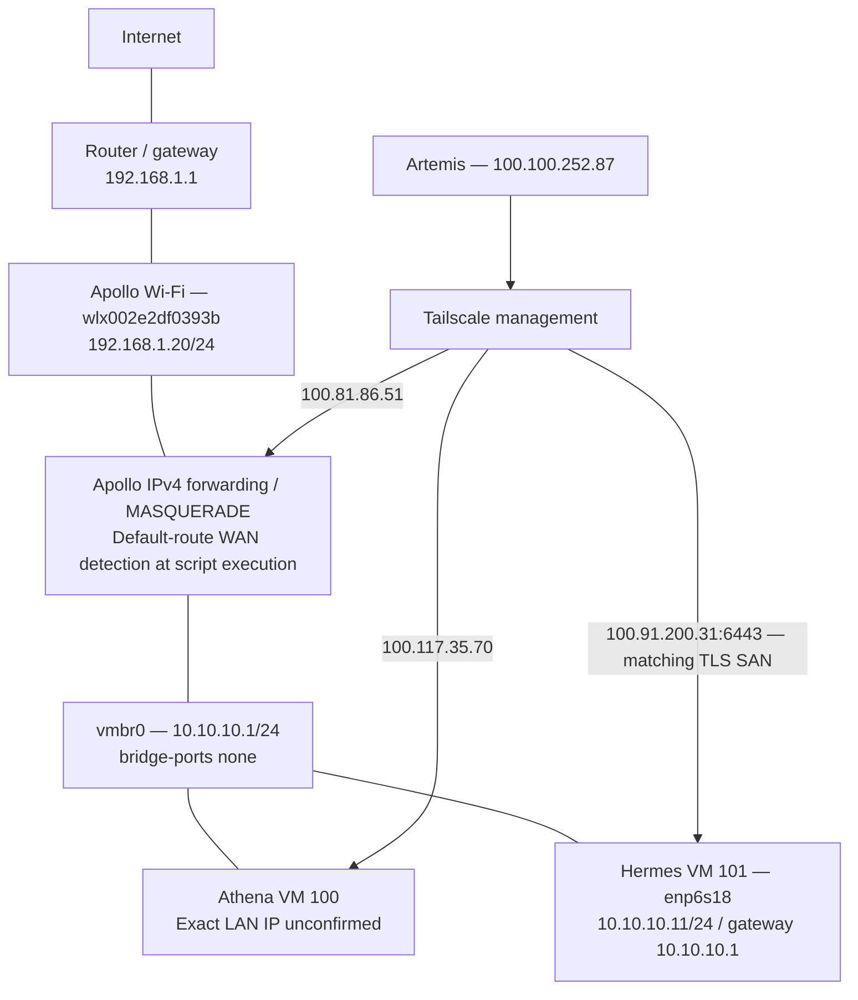

# V2 networking

Baseline from the [September 12 rebuild report](rebuild-history.md).

Ethernet `nic0` is unused. IPv4 forwarding and outbound NAT serve `10.10.10.0/24`. `apollo-firewall.service` runs `/usr/local/sbin/apollo-firewall.sh`, discovers the default-route WAN with up to 15 attempts at two-second intervals, removes duplicate MASQUERADE rules and installs the subnet rule. The reported checks confirmed forwarding and connectivity. WAN discovery happens at script execution.

Athena's new report specifies `10.10.10.x`; earlier `10.10.10.10` is not reconfirmed. Hestia's old `10.10.10.2` is retired. Old Hestia DNAT examples are historical; this report does not establish the final full DNAT ruleset.

## Private management

| Node | Tailscale IP |
|---|---|
| Apollo | `100.81.86.51` |
| Athena | `100.117.35.70` |
| Hermes | `100.91.200.31` |
| Artemis | `100.100.252.87` |

Artemis reaches the K3s API directly at `https://100.91.200.31:6443`. Hermes's `/etc/rancher/k3s/config.yaml` includes that IP in `tls-san`; K3s was restarted and remote `kubectl get nodes` succeeded. This resolves the earlier documented uncertainty over the management API path.

Hermes interface `enp6s18` uses `/etc/netplan/01-hermes.yaml`: static `10.10.10.11/24`, default gateway `10.10.10.1`, DNS `1.1.1.1` and `8.8.8.8`. Full YAML and the wait-online failed-state investigation are in rebuild sections 12–13.

Athena's unauthenticated Docker TCP 2375 listener was removed; the daemon uses its local socket. Glances port 61208 was confirmed intentional. No public Kubernetes API exposure is reported.
