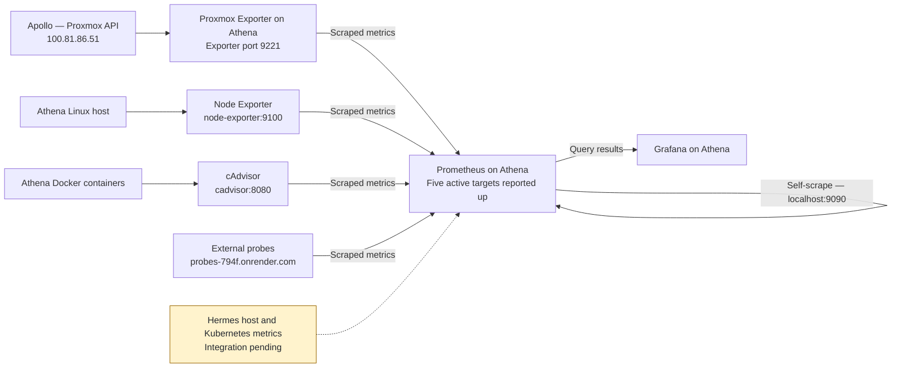
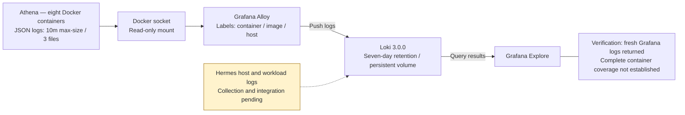
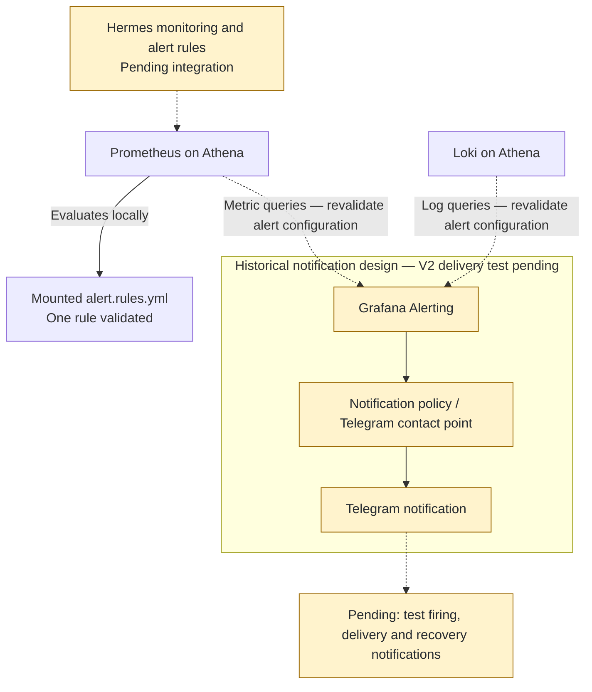

# V2 observability

Athena VM 100 is observability-only. The [September 12 rebuild report](rebuild-history.md) records eight running containers: Prometheus, Grafana, Loki, Alloy, Node Exporter, cAdvisor, Proxmox Exporter and Glances.

## Metrics and logs

| Prometheus job | Reported target / instance | Status |
|---|---|---|
| cadvisor | `cadvisor:8080` | up |
| node | `node-exporter:9100` | up |
| probes | `probes-794f.onrender.com` | up |
| prometheus | `localhost:9090` | up |
| proxmox | `100.81.86.51` | up |

Proxmox Exporter exposes metrics on port 9221 and queries Apollo; Apollo's address is the monitored instance, not necessarily the scrape URL. Hestia is absent from active targets; historical series were retained. Hermes coverage remains pending.

Alloy discovers containers using the mounted Docker socket and labels logs with container, image and host. A Loki query for `{host="athena"}` returned fresh Grafana logs. This verifies that sample pipeline, not exhaustive per-container coverage.

## Configuration and retention

Athena stack directory: `~/homelab/docker-compose/telemetry/`.

- Prometheus: `prometheus/prometheus.yml`; alert rule file mounted read-only at `/etc/prometheus/alert.rules.yml`. Validation passed with one rule file and one rule; readiness passed.
- Loki 3.0.0: `loki/loki-config.yaml`; retention `168h`, compaction interval `10m`, deletion delay `2h`, filesystem delete-request store. Configuration validation and readiness passed after startup stabilization.
- Grafana: host port 3001 → container 3000; version `13.0.1+security-01`, database health `ok`.
- cAdvisor: `v0.49.1`, healthy. Glances intentionally listens on port 61208 with host networking/PID mode.
- Docker JSON logs: `max-size=10m`, `max-file=3`, applied through container recreation.
- Journald: `SystemMaxUse=200M`, `RuntimeMaxUse=50M`, `MaxRetentionSec=7day`.

Persistent volumes: `telemetry_grafana_data`, `telemetry_loki_data`, `telemetry_prometheus_data`. Full configuration excerpts, image tags and validation commands are in rebuild sections 25–50.

## Next validation

Integrate Hermes metrics and host/workload logs, improve dashboards and alerting, and test a controlled Hermes failure while Athena remains available. Earlier Grafana/Telegram alerting records are historical; the supplied V2 health checks do not include a fresh notification-delivery test. All guests share Apollo, so host failure can interrupt both workloads and telemetry.

## Alerting validation

